**ITU UMC Data Hackathon 2026**

> Team: High-Five
>
> Ver. 0.1
>
> May 8 2026

# 1. Overview

## 1.1 Theoretical Understanding

This project examines Seoul\'s digital connectivity through three
analytical stages and derives policy recommendations on the basis of the
results. Digital connectivity is grounded in the Universal Meaningful
Connectivity (UMC) framework proposed by the ITU. The project\'s
analyses are interpreted not as a juxtaposition of separate outputs, but
within a single metatheoretical framework. Metatheory, as a
comprehensive view of the nature of reality, provides philosophical
support for research and practice (Allana & Clark, 2018), and offers a
basis for specifying the ontological position of each methodology. By
explicitly showing the process through which observed phenomena are
generalized into concepts at different levels, the project seeks to
establish its own validity.

This approach has the advantage of providing not only validity for the
project itself, but also a clear basis for application in other
contexts. It can offer alternative points of reference for current
policy implementation. As evidence-based policy has become widespread,
there have been increasing cases in which analytical results are
borrowed and applied without sufficient consideration of the
institutional and cultural conditions of the original context (Dolowitz
& Marsh, 2000). At the same time, critiques of the evidence-based
paradigm itself have accumulated. A representative critique is that the
narrow evidence-based framework fails to capture the complex,
context-dependent, and value-laden character of policymaking (Greenhalgh
& Russell, 2009). Accordingly, a transition from evidence-based policy
to evidence-informed policy has been discussed (Head, 2010), and the
role of evidence is being redefined as guiding policy rather than
constituting its systematic foundation.

Rather than diminishing the importance of empirical evidence, this
project aims to clarify in detail the conditions and core structures
required for applying evidence to other contexts on the basis of a
theoretical framework. It explicitly presents the role of each analysis,
their interconnections, and the interpretive structure that leads to
policy recommendations, while also specifying the key contextual
information needed for interpretation. This reflects the case-study
character of the project itself, which is distinct from the individual
analytical methods.

The individual analytical methodologies are divided into three types.
First, the theoretical framework of UMC is applied to Seoul\'s 25
autonomous districts, which are the actors responsible for policy
implementation, in order to measure disparities. Next, a multilevel
model is used to separate the contributions of individual factors and
district-level factors to individuals\' digital connectivity problems.
Finally, empirical evidence on Seoul\'s digital connectivity problems
generalized in the preceding analyses is restored to individual
phenomena observed through unstructured text. This includes a procedure
for abstracting and reconstructing individual experiences in accordance
with the conceptual framework of UMC. The concept of UMC proposed by the
ITU is compared with aggregated results and actual empirical evidence.
Finally, the causal mechanisms through which actual phenomena occur are
inferred from the concept. These complex transitions across levels are
grounded in the stratified ontology proposed by critical realism, namely
the distinction among the empirical, real, and actual domains (Bhaskar,
1975).

The need for this process can be illustrated through a hypothetical
situation. Suppose, for example, that observed empirical evidence shows
that residential areas in station areas served by express subway lines
have higher housing prices than residential areas around stations that
are not served by such lines. Apart from the validity of the result, the
finding itself is difficult to regard as meaningful knowledge. It may
apply only to Seoul. Moreover, making every station served by an express
line on the basis of this result is neither politically nor logically
feasible. Universally valid knowledge about the world is established
through valid inference that goes beyond the generalization of empirical
evidence (Bhaskar, 1975). In the preceding situation, one example would
be to identify a mechanism whereby the high value of time in Seoul
causes express lines that reduce travel time to be reflected in housing
prices. The next section explains the advantages that the individual
analytical methodologies themselves offer for application in other
contexts.

## 1.2 Understanding the Analytical Methods

The purpose of this section is to explain the three analytical methods
and, separately from the metatheoretical framework presented above, to
clarify the basis on which each methodology itself can be applied to
other contexts. First, empirical patterns are identified through
regression-based analysis of the data. The discussion separates the
validity of the metalevel structure, which measures and abstracts
individual observations and then restores them to individual phenomena
while testing whether the UMC concept is also manifested empirically,
from the applicability of the individual methodologies.

First, district-level UMC in Seoul is measured to show where disparities
exist and along which dimensions. The measurement indicators are based
on the conceptual definitions of the six dimensions proposed by ITU
(2023), but are operationalized to fit Seoul\'s data environment and
urban characteristics. The actors that actually implement policy are
distributed not only at the national level but also across various
units, including local governments. Accordingly, this project sets
Seoul\'s 25 autonomous districts as the unit of measurement and analysis
so that the analytical unit corresponds to the unit of policy
implementation. Because the conceptual definitions and the operational
definitions appropriate to the study area are applied separately,
indicators can be substituted to fit each city\'s data environment while
maintaining the same six-dimensional structure. The selection of
measurement indicators and the results are detailed in Section 3.1.

Next, using a two-level hierarchical linear model (HLM) that includes
both individual characteristics and autonomous-district-level UMC
infrastructure characteristics, the analysis examines for whom and under
what conditions differences in digital usage are most pronounced. The
aim is to empirically generalize the causal mechanisms of the digital
usage divide. Even within the same administrative area, digital usage
can vary substantially according to individuals\' educational
attainment, age, and household composition. HLM is a standard method for
accounting for the hierarchical data structure in which individuals are
nested within districts, and the same analytical framework can be
applied to other cities by replacing the input variables according to
the demographic characteristics and infrastructure conditions of the
relevant context. The selection of variables, model specification, and
detailed design of cross-level interactions are presented in Section
3.2.

Finally, unstructured text is used to restore individual phenomena that
the preceding two analyses cannot capture, to abstract them into
higher-level structures appropriate to the UMC concept, and to test the
coherence between inferred causal mechanisms and the observed empirical
world. Individual cases are not immediately equated with the
district-level UMC concept; rather, they pass through a process of
abstraction and are compared with the preceding observed results in
order to reveal deeper causal mechanisms. The need for this process can
be illustrated through a hypothetical situation.

Text analysis has two requirements. First, it must be possible to
determine whether individual text cases are related to digital
connectivity and to classify them according to the predefined
theoretical framework of the six UMC dimensions. Second, the analytical
method must not be strongly tied to a particular language. Because the
UMC framework is comprehensive, text analysis likewise requires language
independence. To satisfy these two conditions, a large language model
(LLM) is used as a theory-driven text classification tool. Because an
LLM processes meaning at the contextual level rather than at the
morpheme level, it is robust to nonstandard expressions in Korean
everyday-life text; by directly presenting the UMC dimensions in the
prompt, the researcher can control the classification criteria.
Methodological transferability is secured insofar as the same prompt
structure can be applied to texts in other languages.

Specifically, the measured UMC values from Section 3.1 are combined as
the prior distribution with the text classification results as the
likelihood to estimate district-level UMC through Bayesian estimation.
Then, within the range permitted by the HLM results in Section 3.2, the
mechanisms between structure and experience are visualized. Finally, the
causal mechanisms between individual posts and the regional UMC concept
are inferred. At this stage, three independent layers of inference are
designed-abductive, prospective, and path-based-so that each inference
agent generates hypotheses without referring to the outputs of the
others, after which a higher-level adjudication agent synthesizes them.
Separating the inference layers suppresses bias from any single
inferential path and makes it possible to observe convergence and
divergence among hypotheses. The prompt design, strategies for reducing
misclassification, Bayesian updating, and detailed inference procedures
are presented in Section 3.3.

In summary, within the structure of this project, Chapter 2 provides the
interpretive context for reading the results in Chapter 3, and Section
3.3 functions as a mediating stage that reconnects the results of
Sections 3.1 and 3.2 with experiences in the lifeworld. The three
analyses answer different questions, while forming a sequential
structure in which the output of one analysis becomes the input for the
next analysis (see figure 1). By separating conceptual structure from
operational definitions and specifying which elements are replaceable
and which are fixed, each methodology establishes the conditions under
which the same analytical framework can be applied beyond Seoul (see
figure 1).

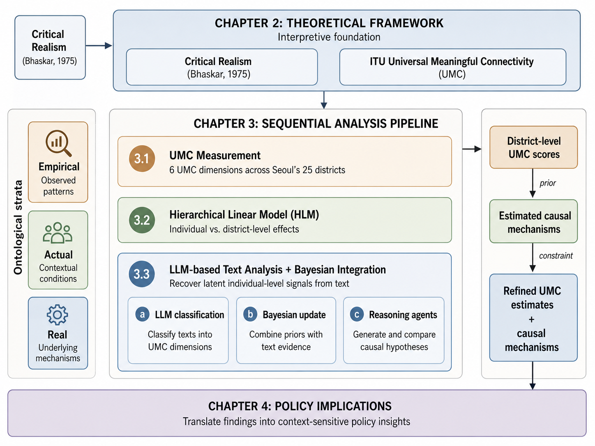{width="6.35in"
height="4.7625in"}

# 2. Theoretical Foundations and Interpretive Context

This chapter presents the theoretical foundations for the analysis and
the interpretive context for Chapter 3. It first reviews the individual
and regional factors that affect the digital divide. It then examines
the distinction in public policy between a people-based approach and a
place-based approach, as well as the background of recent discussions on
a place-sensitive approach. Next, it reviews critical realism, the
metatheoretical framework of this project, and cases of its application
in empirical research. Finally, it examines Seoul\'s demographic,
administrative, and infrastructure conditions in order to provide the
contextual information needed to interpret the analytical results.

## 2.1 Policy

In the design of public policy, the distinction between interventions
that target people\'s characteristics, or a people-based approach, and
those that target place conditions, or a place-based approach, is a
long-standing debate. People-based policies seek to improve outcomes by
directly supporting human characteristics such as individual competency,
income, and education. Place-based policies seek to indirectly improve
outcomes for residents of a given area by improving that area\'s
infrastructure, institutions, and environmental conditions (Neumark &
Simpson, 2015). The two approaches are not mutually exclusive, but
because the allocation of policy resources and the pathways of
intervention differ, they need to be designed separately from the
perspective of policy implementation.

### 2.1.1 Factors Affecting the Digital Divide: Individual Characteristics and Regional Conditions

In the literature on the digital divide, studies that focus on
individual characteristics show that, even within the same region,
individual characteristics are a principal factor explaining disparities
in digital usage. Hargittai (2010) argued that the divide after internet
access-that is, differences in patterns of use-determines substantive
inequality. This finding suggests that disparities in digital usage may
persist according to socioeconomic status. Chipeva et al. (2018) showed
that usefulness is the strongest motivation for technology use across
various countries, while also demonstrating that individuals\' internal
characteristics significantly affect the use of digital devices. Borges
et al. (2020), through the case of Angola, reported that habits and
proficiency in ICT skills are key factors in the divide prior to the
diffusion of devices. Hilbert\'s (2011) analysis of 18 Latin American
countries showed that a gender digital divide exists and that internet
use is more active in countries with higher levels of gender equality.

At the same time, evidence has also accumulated that regional
environments have additional explanatory power for digital usage even
after controlling for individual characteristics. Applying HLM to the
United States, Mossberger et al. (2006) showed that disparities in
internet access stem from high-poverty neighborhood environments rather
than from race itself. This suggests that the structural conditions of a
region can independently affect individual outcomes. Through a
comparative qualitative case study of Newcastle in the United Kingdom,
Crang et al. (2006) showed that the local environment structures the way
digital networks are used. Hong et al.\'s (2017) analysis of Chinese
adults aged 45 and older showed that internet users are concentrated
among high-income, highly educated, and urban-resident groups,
suggesting that district-level infrastructure and opportunity structures
can condition the possibility of use.

### 2.1.2 Policy Distinctions: People-Based, Place-Based, and Place-Sensitive Approaches

The two types of factors reviewed in the preceding section correspond to
the distinction in public policy design between a people-based approach
and a place-based approach. People-based policies seek to improve
outcomes by directly supporting human characteristics such as individual
competency, income, and education. Place-based policies seek to
indirectly improve outcomes for residents of a given area by improving
that area\'s infrastructure, institutions, and environmental conditions
(Neumark & Simpson, 2015). The two approaches are not mutually
exclusive, but because the allocation of policy resources and the
pathways of intervention differ, they need to be designed separately
from the perspective of policy implementation.

However, the relationship between the two approaches is not a simple
parallel. Hindman\'s (2000) time-series analysis of the United States
showed that income, age, and education are stronger predictors than
geography, while also reporting a pattern in which disparities become
entrenched over time. This implies that individual characteristics and
regional structures can interact over time. van Dijk (2020) proposed a
sequential model moving from lack of motivation to material access,
skills, and substantive use, suggesting that individual factors and
structural factors operate cumulatively.

In this context, recent policy and academic literature has been moving
away from an either-or choice between people-based and place-based
approaches and toward a place-sensitive approach that understands
people\'s experiences within the context of place. One example is the
attempt to recognize lived experience and place-based insight as forms
of knowledge equivalent to quantitative evidence (OECD, 2025). This
approach requires that people-based factors and place-based factors be
analytically separated, while also considering how the two combine in
specific places.

### 2.1.3 Metatheoretical Framework: Critical Realism\'s Stratified Ontology

This project adopts the separation of people-based factors and
place-based factors as a basic principle of its analytical design, and
grounds the metatheoretical foundation of that design in the stratified
ontology of critical realism. According to Bhaskar(1975), the world
consists of three domains. The real domain includes structures,
mechanisms, and causal powers that exist independently of whether they
are observed. The actual domain is the domain in which these structures
and mechanisms operate under particular conditions and generate events.
The empirical domain refers to the subset of events that have occurred
and are observable. Not all events in the actual domain are experienced,
nor do observed phenomena represent the entirety of the real domain.

This ontological distinction entails the logic of retroduction(Bhaskar,
1975). Retroduction is a method that infers backward from observed
empirical events to the structures and mechanisms that made those events
possible. It is distinct from induction and deduction, and asks, \"What
structure must exist for this phenomenon to be possible?\"

## 2.2 Seoul

### 2.2.1 Seoul as a City

Seoul, the capital of the Republic of Korea, is a highly dense
metropolis in which 20% of the national population resides on 0.6% of
the country\'s total land area. Because of its high density and
concentration of technological capacity, Seoul has stood at the
forefront of South Korea\'s digital transformation. Yet a closer look
inside Seoul reveals meaningful disparities associated with the
demographic structure and economic self-sufficiency of each of Seoul\'s
25 autonomous districts. This section examines the characteristics of
each autonomous district in Seoul and discusses the features of Seoul\'s
population geography.

In recent years, Seoul\'s population geography has been reorganized
along two axes: rapid aging and the expansion of single-person
households. Northern peripheral districts such as Gangbuk-gu(26.03%) and
Dobong-gu(25.85%) already have shares of older adults exceeding 25% and
exhibit characteristics of a super-aged society, whereas the Gangnam
area and neighborhoods around major universities maintain relatively
younger population structures, making inter-district imbalances in age
distribution pronounced. These demographic differences, combined with
each district\'s average income level and economic vitality, form the
structural backdrop that produces the differences in Affordability and
Devices capabilities identified in Section 3.1 of this study.

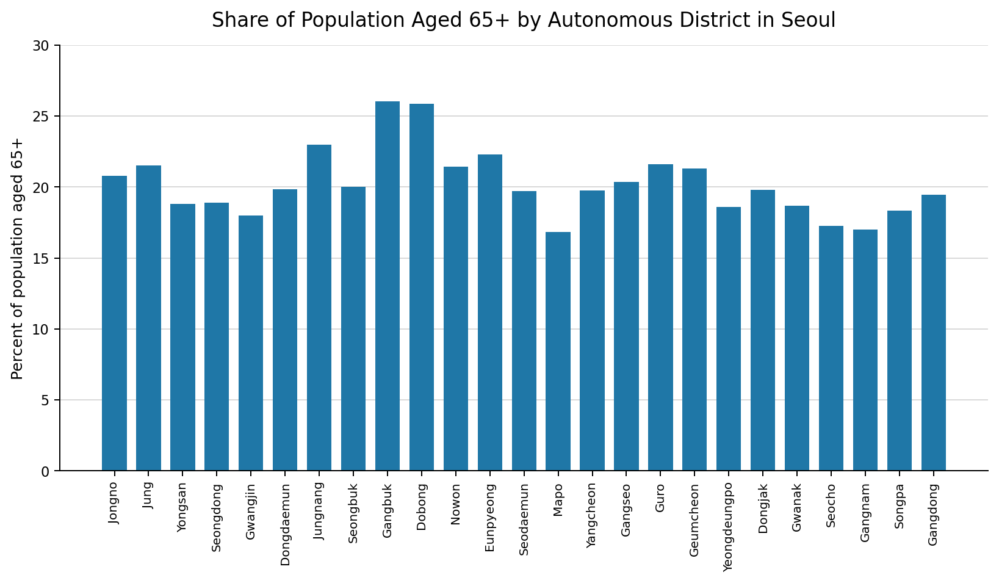{width="4.447222222222222in"
height="2.673611111111111in"}

In addition, Seoul\'s policy implementation system operates through
organic cooperation between the metropolitan government, the Seoul
Metropolitan Government, and the 25 lower-level autonomous districts.
The broad direction of policy follows a top-down approach established by
Seoul City Hall, which plays a central role in building
metropolitan-scale infrastructure and setting standard guidelines for
digital inclusion. At the same time, Seoul also operates bottom-up
decision-making structures, including the citizen participatory
budgeting system and residents\' associations, through which digital
inconveniences experienced by local residents in everyday life are
directly reflected in policy. Based on these metropolitan plans,
autonomous districts finalize budgets through local council deliberation
and ordinance enactment, and ultimately deliver close-to-resident
services to citizens through neighborhood community service centers. In
this sense, Seoul\'s policies for reducing the digital divide can be
understood as being realized through a multilayered process that
combines the administrative capacity of each autonomous district with
citizen participation, rather than through uniform central execution.

### 2.2.2 Current Status of Connectivity Gaps and Related Laws and Policies

The current state of digital connectivity in Seoul clearly reveals the
limits of privately led infrastructure deployment through disparities in
radio station infrastructure density across autonomous districts.
According to Korea Radio Promotion Association statistics on radio
stations for 2020-2025, the core infrastructure determining Seoul\'s
communication quality, namely base stations and mobile repeaters, is
overwhelmingly concentrated in particular areas where profitability is
high and traffic is concentrated. Southeastern districts such as
Gangnam-gu(base stations 19,190; mobile repeaters 2,711) and
Songpa-gu(base stations 14,751) possess dense networks, whereas northern
peripheral districts such as Dobong-gu(base stations 4,008) and
Gangbuk-gu(base stations 4,700) show a gap of up to 4.8 times in the
number of base stations. In particular, for simple radio stations used
for small businesses and Internet of Things(IoT) connectivity,
Gangnam-gu(24,236) has about 20 times as many as Dobong-gu(1,224),
suggesting that a rich-get-richer and poor-get-poorer pattern in the
digital ecosystem across autonomous districts has already become
entrenched at the level of physical infrastructure.

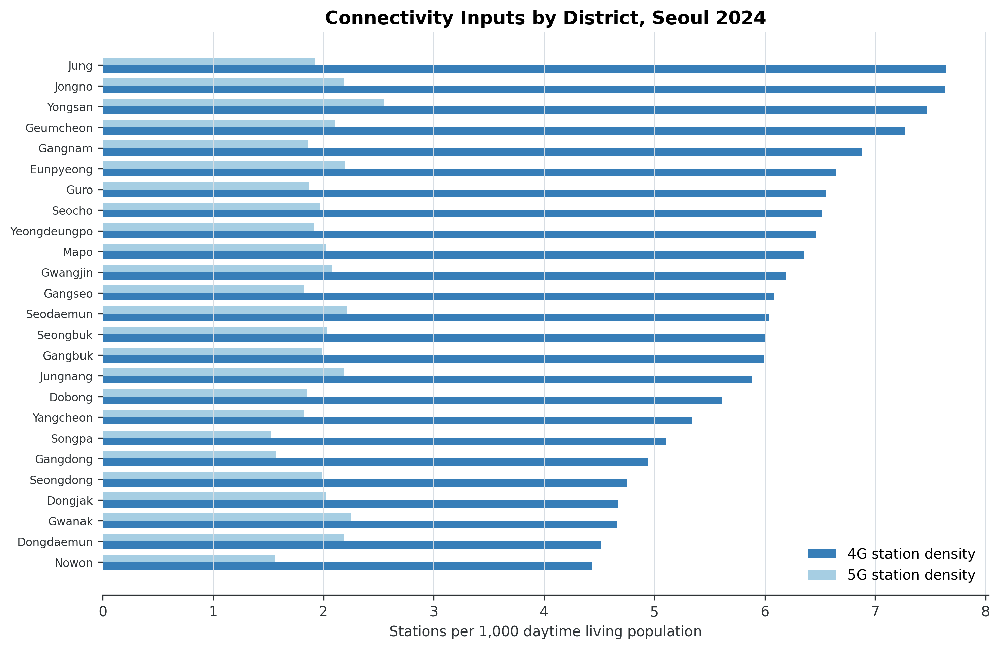{width="5.301042213473316in"
height="3.021195319335083in"}

To correct these regional imbalances in private infrastructure and
guarantee citizens\' basic right to communication, Seoul made the policy
decision to step forward directly as a facilities-based
telecommunications service provider as an administrative alternative.
Under the 2025 amendment to the Telecommunications Business Act, Seoul
became the first local government to secure the status of a
telecommunications service provider, and it is expanding public Wi-Fi
and IoT infrastructure by directly connecting more than 5,000 km of its
own fiber-optic cable network to underserved areas where private
telecommunications companies have invested insufficiently because of
profitability concerns. Seoul currently operates more than 34,000 public
Wi-Fi units, the largest scale in the country; these are widely
installed on streets, in parks, markets, welfare facilities, and city
buses, generating an annual reduction of approximately KRW 200 billion
in citizens\' communication costs. In particular, mobile Wi-Fi installed
on roughly 7,000 city buses has become a form of digital infrastructure
that citizens experience most directly in everyday life. Through the
expansion of public Wi-Fi, Seoul plans to reduce disparities in
information access and ease the household burden of communication costs
amounting to hundreds of billions of won each year. It also seeks to
establish a sustainable virtuous cycle by lowering dependence on
privately leased networks and reinvesting the secured resources in
projects that benefit citizens.

Policy responses to address these infrastructure gaps have moved beyond
physical network expansion and increasingly focus on strengthening
Affordability by lowering citizens\' actual cost burden. The central and
local governments operate the Smart Choice platform to help users
understand their own communication consumption patterns and make
rational choices. Smart Choice provides integrated services such as
checking handset subsidies, recommending customized rate plans, and
searching for unclaimed refunds, thereby reducing information asymmetry
and encouraging reductions in household communication costs.

The recent reform of 5G rate plans is especially significant in that it
shifted a market structure centered on high-priced plans toward one
centered on low- and mid-priced plans. The lowest 5G price tier, which
had previously remained in the KRW 40,000-50,000 range, was lowered to
the KRW 30,000 range, and intermediate plan tiers between 30 and 100GB
were newly and more finely introduced to correspond to actual data
usage. This reform addressed the structural contradiction in which users
paid high costs for data they did not use, and by 2024 it had led to a
concrete policy outcome in which more than 6 million subscribers
switched to low- and mid-priced plans.

Customized dedicated rate plans for vulnerable groups and specific age
groups have also been substantially strengthened. For young people(age
34 and below), the three major mobile carriers in the Republic of Korea
expanded the amount of data provided by up to twice that of ordinary
plans at the same price, taking into account high data demand among this
group, and broadened the eligible population by raising the upper age
limit for subscription from age 29 to 34. In addition, for older
adults(age 65 and above), LG U+ launched dedicated rate plans segmented
by age group(65, 70, 80, and so on) that are up to 20% cheaper than
ordinary plans, reflecting older adults\' relatively lower data usage
and higher price sensitivity. Furthermore, in line with the trend toward
non-face-to-face subscription, online-only rate plans have expanded
choice by introducing no-contract plans that are approximately 30%
cheaper than ordinary plans when users subscribe through online channels
without visiting a retail store.

As a result, Seoul is building a multifaceted inclusion policy that
guarantees universal digital basic rights for all citizens through a
three-part framework: information transparency through Smart Choice, the
rational rate structures of the three major mobile carriers, and
Seoul\'s direct provision of public infrastructure.

In addition, the most significant change in Seoul\'s administrative
services in 2026 is the unification and upgrading of mobile platforms.
Seoul will terminate the previously fragmented Seoul Citizen Card and
Seoul Wallet services as of March 31, 2026, and consolidate their
functions into the integrated mobile platform Seoul ON. By enabling
citizens to address everything from the use of public facilities such as
libraries and sports facilities to verification of disability or
national merit status within a single app, this change lowers the entry
barrier to digital administration created by service fragmentation. In
particular, Seoul ON enhances administrative efficiency by strengthening
the function that verifies eligibility for vulnerable-group status in
real time through linkage with public MyData, without requiring separate
document submission.

Furthermore, Seoul is pursuing an integrated inclusion policy centered
on the AI Digital Learning Center so that infrastructure expansion and
service integration lead to genuine improvements in citizens\' practical
usage capabilities. Using nationwide digital learning center sites,
including 10 sites in Seoul, the city provides ongoing face-to-face
education for older adults and digitally vulnerable groups, and offers
not only basic internet-use instruction but also life-oriented AI
experience education and education to prevent digital dysfunction. In
particular, it is closing educational blind spots by expanding
\"visiting 1:1 education\" for people such as those with severe
disabilities who have mobility difficulties, and by establishing a
level-specific customized education system linked across online and
offline formats. This approach reflects the judgment that even when
hardware(infrastructure) and software(administrative services) are in
place, gaps will not be resolved if people lack the human capabilities
needed to use them. In this way, Seoul is substantively realizing
Universal Meaningful Connectivity(UMC) through a three-part framework:
securing infrastructure stability based on law, innovating the service
delivery system through Seoul ON, and improving users\' capabilities
through education.

# 3. Analysis

The three analyses in this chapter are sequentially connected. First,
the study constructs a UMC index by autonomous district in Seoul to
measure regional disparities(3.1). It then uses these results as
district-level variables to analyze the effects of individual and
district characteristics on individuals\' digital connectivity(3.2).
Finally, it derives concrete cases not captured by the quantitative
analysis through digital platform text. This sequence consists of
measurement, causal identification, and phenomenological
supplementation, and Section 3.4 synthesizes the results of the three
analyses.

## 3.1 Regional Disparities in UMC in Seoul

### 3.1.1 Measurement Indicators and Data

The measurement indicators constructed in this project are based on the
conceptual definitions of the six dimensions of UMC. These dimensions
are classified as Connectivity, Available for Use, Affordability,
Devices, Skills, and Safety, and the individual measurement indicators
were specified according to two core components that simultaneously
consider meaningfulness and universality(ITU, 2023). The measurement
indicators for the six dimensions comprising Seoul\'s UMC used in this
analysis are shown in \<Table 1\>.

In selecting measurement indicators, the analysis comprehensively
considered alignment with conceptual definitions, Seoul\'s digital
technology environment, and data availability. The analysis used data
from two time points, 2023 and 2024, the most recent years for which
data could be secured. National administrative data and related sources
from these two time points were used. However, because of limitations in
the timing of data provision, the Devices, Skills, and Safety dimensions
applied the same values for both time points based on 2023 survey data.

For Connectivity, measurement indicators were calculated using mobile
communication radio station data provided by Korea Radio Promotion
Association and living population data from Seoul\'s administrative
data. According to ITU(2023), Connectivity can be measured based on the
population residing within network coverage. In Korea, however, the
separation between workplace and residence is often pronounced, so the
area of residence may differ from the area where individuals actually
access the digital environment. Accordingly, this study devised an
indicator more appropriate to the Korean context by calculating 4G and
5G network coverage using daytime floating population data rather than
simple resident population. Specifically, the numbers of 4G base
stations and 5G base stations were each converted into the number of
base stations per 1,000 daytime living population at the
enumeration-district level, and the final indicator used the average of
these values by autonomous district.

Available for Use is the dimension that measures the practical usability
of digital services. Monthly mobile data usage per household within each
area, provided by SKT communication information, and online service
usage days in four categories, finance, shopping, video, and delivery,
were aggregated monthly by autonomous district as population-weighted
averages, and the 12-month average values were used. In addition, data
on public Wi-Fi registration status from autonomous district governments
were used to calculate and include the number of public Wi-Fi APs per
1,000 total population. Public Wi-Fi density functions as an especially
important digital access pathway for older adults whose home internet
access environment is limited(Van Dijk, 2020).

Affordability was constructed following the two-axis structure of the
ITU ICT Development Index 2023(ITU, 2024). For the purchasing
power(capacity) side, the analysis used average monthly household income
by autonomous district provided by Seoul\'s Commercial District Analysis
Service. For the price burden(burden) side, it used the share of bill
arrears within the most recent three months from SKT communication
information. The arrears rate was calculated as a population-weighted
average by administrative dong, sex, and age group, and then aggregated
to the autonomous-district level; it is a reverse-coded indicator,
meaning that higher values indicate lower economic accessibility.

Devices measures the possession and diversity of use of digital devices.
The weighted averages by autonomous district were calculated for the
number of core digital device types owned within households and the
number of device types actually used by individuals, based on the Seoul
Citizens\' Digital Competency Survey. According to ITU(2023), possession
and use are interpreted differently depending on device characteristics,
such as mobile phones and computers. In the Korean domestic context,
whether a computer is owned can also be an indicator of digital
connectivity. In Seoul, where smartphone penetration is effectively
saturated, ownership of auxiliary devices such as desktops, laptops, and
tablets acts as a differentiating factor in digital usage capability(Van
Deursen & Helsper, 2015).

Digital Skills comprises four subdomains: Basic, Applied, Advanced, and
Cyber activity. Basic competency measures the basic ability to operate
smart devices; Applied competency measures the ability to use digital
services; Advanced competency measures proficiency in smart-device
activities; and Cyber activity competency measures the ability to act in
cyberspace. The raw score for each subdomain was divided by its maximum
possible score and converted to a 0-1 ratio, after which weighted
averages were calculated by autonomous district.

Safety comprises two subindicators: digital security behavior and
security awareness. Security behavior measures actual security
practices, such as password management, software updates, and use of
two-factor authentication, while security awareness measures the level
of recognition of the importance of personal information protection.
Each subindicator was converted to a ratio relative to its maximum
possible score, and weighted averages were then calculated by autonomous
district.

**\**

  ------------------------------------------------------------------------------
  **Dimension**   **Indicators**         **Data Source**   **Note**
  --------------- ---------------------- ----------------- ---------------------
  Connectivity    station_density_4g,    Spectrum Resource Per 1,000 daytime
                  station_density_5g,    Mgmt System; NIA  living population; CQ
                  download_speed         Communication     uses 2022-2024
                                         Quality           average

  Available for   mobile_data_usage,     SKT Telecom Data; Population-weighted
  Use             online_service_days,   Local             district average;
                  wifi_density           Administrative    Wi-Fi per 1,000 total
                                         Wi-Fi License     population
                                         Data              

  Affordability   avg_income,            Seoul Commercial  ITU IDI capacity +
                  delinq_rate (reverse)  Analysis Service; burden; delinq =
                                         SKT Telecom Data  reverse-coded

  Devices         device_home_core,      Seoul Citizens\'  Home: excluding
                  device_use_core        Digital           smartphones; Use:
                                         Competency Survey including smartphones
                                         2023              

  Digital Skills  Basic / Applied /      Seoul Citizens\'  \-
                  Advanced / Cyber       Digital           
                  activity               Competency Survey 
                                         2023              

  Safety          safety_behavior,       Seoul Citizens\'  Security practices (7
                  safety_awareness       Digital           items) + awareness (3
                                         Competency Survey items)
                                         2023              
  ------------------------------------------------------------------------------

  : Table 1. UMC Dimension Indicators

### 3.1.2 Indexing the Measurement Indicators

All raw indicators were normalized to the \[0, 1\] interval through
Min-Max scaling across the 25 autonomous districts. The normalized value
x\* is calculated as shown in Equation 1.1.

{width="5.404724409448819in"
height="0.999504593175853in"}

At this stage, reverse-direction indicators, for which larger values
indicate worse outcomes, were transformed so that all indicators had a
consistent direction. Next, the normalized indicators within each
dimension were combined using an equally weighted arithmetic mean to
calculate dimension-level scores. Equal weights were used in the
analysis to minimize arbitrary researcher judgment in the absence of an
agreed standard for the relative importance of the six dimensions (ITU,
2024). The resulting composite index ranges from 0 (lowest) to 1
(highest), and was calculated independently for 2023 and 2024 for all 25
autonomous districts in Seoul. A key point for interpretation is that
this composite index represents each district\'s relative position among
other autonomous districts in Seoul, rather than an absolute level of
regional UMC.

### 3.1.3 Characteristics of the UMC Index by District

The 2024 UMC composite index for the 25 autonomous districts ranged from
0.279 (Jungnang-gu) to 0.695 (Seocho-gu), indicating an approximately
2.5-fold gap between the highest and lowest districts. Despite the
common perception that Seoul is a city with high internet penetration, a
substantial relative digital connectivity divide was observed at the
lower administrative-unit level. The top five autonomous districts were
Seocho-gu (0.695), Yeongdeungpo-gu (0.686), Mapo-gu (0.665),
Seodaemun-gu (0.615), and Yongsan-gu (0.603). The bottom five were
Jungnang-gu (0.279), Dobong-gu (0.303), Gangbuk-gu (0.380), Guro-gu
(0.389), and Nowon-gu (0.389). Higher-ranked districts were generally
located in the central city or the Gangnam area, benefiting from dense
commercial activity, high income levels, and abundant private digital
infrastructure, whereas lower-ranked districts were concentrated in the
northern periphery and the southwest.

Examining the spatial distribution of the composite index (Figure 1),
autonomous districts with high UMC index values were concentrated in two
areas. These were the Han River and central-city corridor running from
Seocho to Yeongdeungpo and Mapo, and the traditional downtown area
centered on Yongsan, Jongno, and Jung-gu. By contrast, the northern
periphery (Gangbuk-gu, Dobong-gu, Nowon-gu) and the southwest (Guro-gu,
Geumcheon-gu) scored below the city average. This spatial distribution
was associated with the distribution of socioeconomic resources in
Seoul. In other words, it suggests that the digital divide may be
closely linked to structural spatial inequality in the city.

At the same time, the dimension-level analysis found that no autonomous
district performed uniformly well across all six dimensions (Figure 3).
For example, Eunpyeong-gu in northern Seoul ranked high in the
Connectivity dimension, with a score of 0.781, but remained in the lower
tier in the Affordability dimension, with a score of 0.328. Similarly,
Gwanak-gu ranked first in the Digital Skills dimension, with a score of
0.795, but fell into the lowest tier for Affordability, at 0.152. These
multidimensional inter-district inequalities indicate that
policy-relevant dimension-specific vulnerabilities cannot be captured by
the composite ranking alone.

In conclusion, as shown in Figure 4, this project provisionally
classifies the four spatially clustered autonomous districts in the
lowest group of the composite index (Jungnang-gu, Dobong-gu, Gangbuk-gu,
and Nowon-gu) as Digital Deserts. These districts commonly exhibit clear
deficits in the Devices and Safety dimensions, and Affordability also
falls below the Seoul average. Meanwhile, in the Connectivity dimension,
some districts (Jungnang-gu 0.630, Gangbuk-gu 0.562) exceed the Seoul
average, indicating that the core divide may stem from insufficient
human and economic capabilities to use physical network infrastructure
rather than from the absence of that infrastructure itself. This finding
is examined more systematically in Section 3.2 by separating and testing
the relative contributions of individual-level and district-level
variables in a multilevel analysis.

In addition, geographically adjacent areas displayed similar patterns in
some dimensions of UMC. \<Figure 4\> shows the spatial autocorrelation
of districts by dimension. The fact that spatially clustered autonomous
districts show similar patterns suggests the possibility of establishing
a metropolitan governance system to address Digital Deserts.

In conclusion, as shown in Figure 4, this project provisionally
classifies the five autonomous districts in the lowest group of the
composite index (Jungnang-gu, Dobong-gu, Gangbuk-gu, Guro-gu, and
Nowon-gu) as Digital Deserts. These districts commonly exhibit clear
deficits in the Devices and Safety dimensions, and Affordability also
falls below the Seoul average. Meanwhile, in the Connectivity dimension,
some districts (Jungnang-gu 0.630, Gangbuk-gu 0.562) exceed the Seoul
average, indicating that the core divide may stem from insufficient
human and economic capabilities to use physical network infrastructure
rather than from the absence of that infrastructure itself. This finding
is examined more systematically in Section 3.2 by separating and testing
the relative contributions of individual-level and district-level
variables in a multilevel analysis. In addition, geographically adjacent
areas displayed similar patterns in some dimensions of UMC. \<Figure 5\>
shows the spatial autocorrelation of districts by dimension. The fact
that spatially clustered autonomous districts show similar patterns
suggests the possibility of establishing a metropolitan governance
system to address Digital Deserts.

  ------------------------------------------------------------------------------------------------------------
  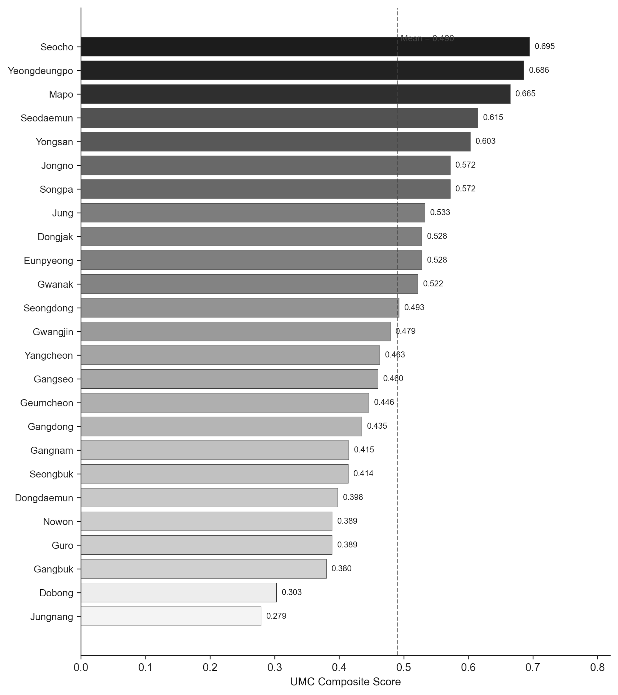{width="3.3810126859142606in"   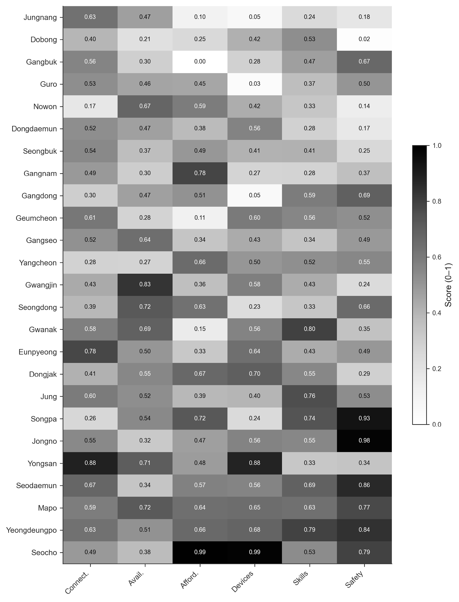{width="2.931312335958005in"
  height="3.799176509186352in"}                          height="3.8411187664041995in"}
  ------------------------------------------------------ -----------------------------------------------------
  **Figure 2. UMC Composite Scores by District**         **Figure 3. Heatmap of UMC Dimension Scores**

  ------------------------------------------------------------------------------------------------------------

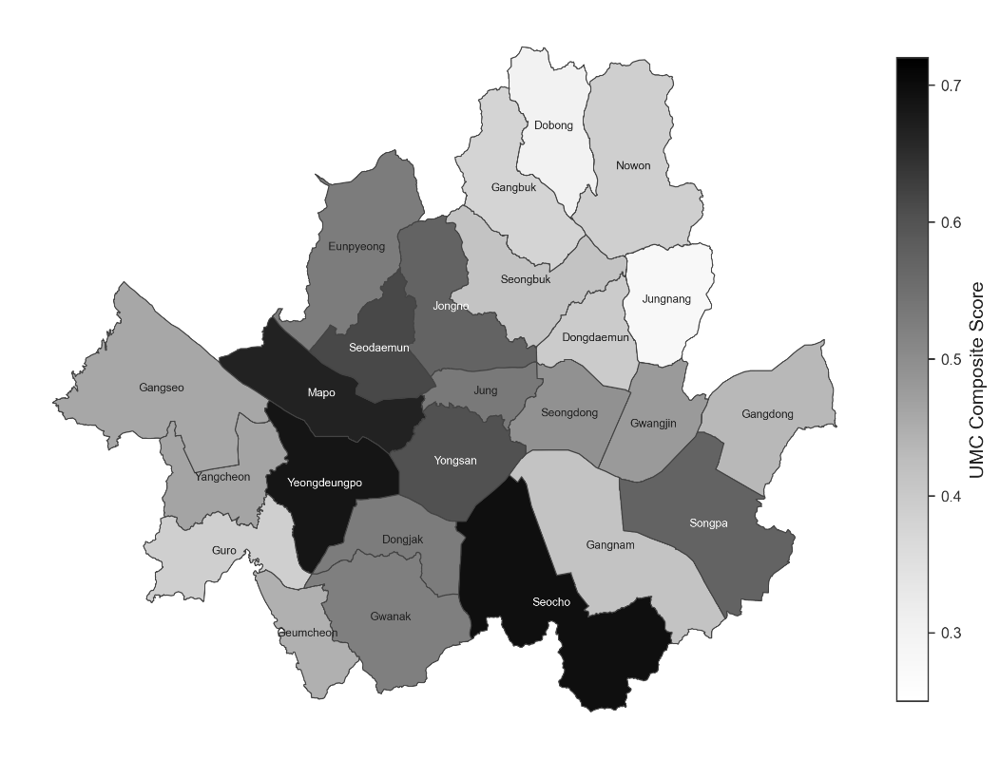{width="6.35in"
height="4.828770778652668in"}

+----------------------------------------------------------------------------------------+-----------------------------------------------------------------------------------------+
| ## 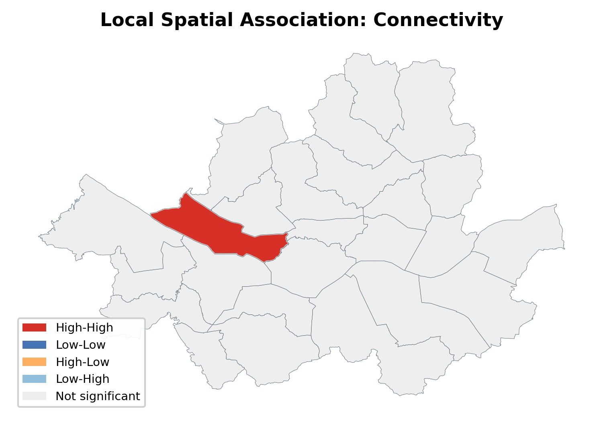{width="3.4572922134733157in" height="1.8490255905511812in"} | ## 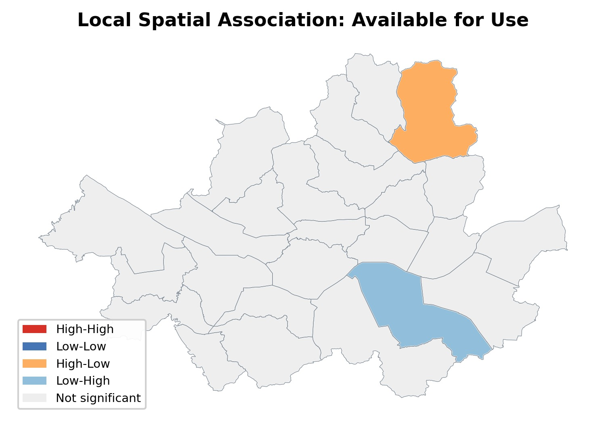{width="2.7697922134733157in" height="2.0194094488188976in"}  |
+========================================================================================+=========================================================================================+
| Connectivity                                                                           | Available for Use                                                                       |
+----------------------------------------------------------------------------------------+-----------------------------------------------------------------------------------------+
| ## 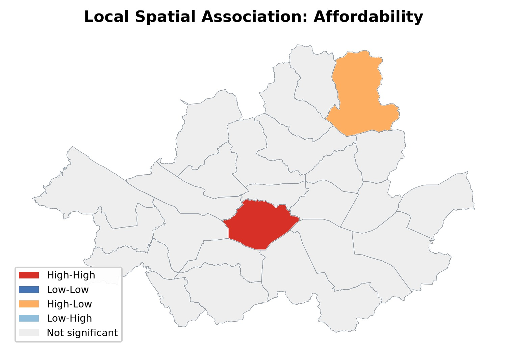{width="2.478125546806649in" height="1.8125in"}             | ## 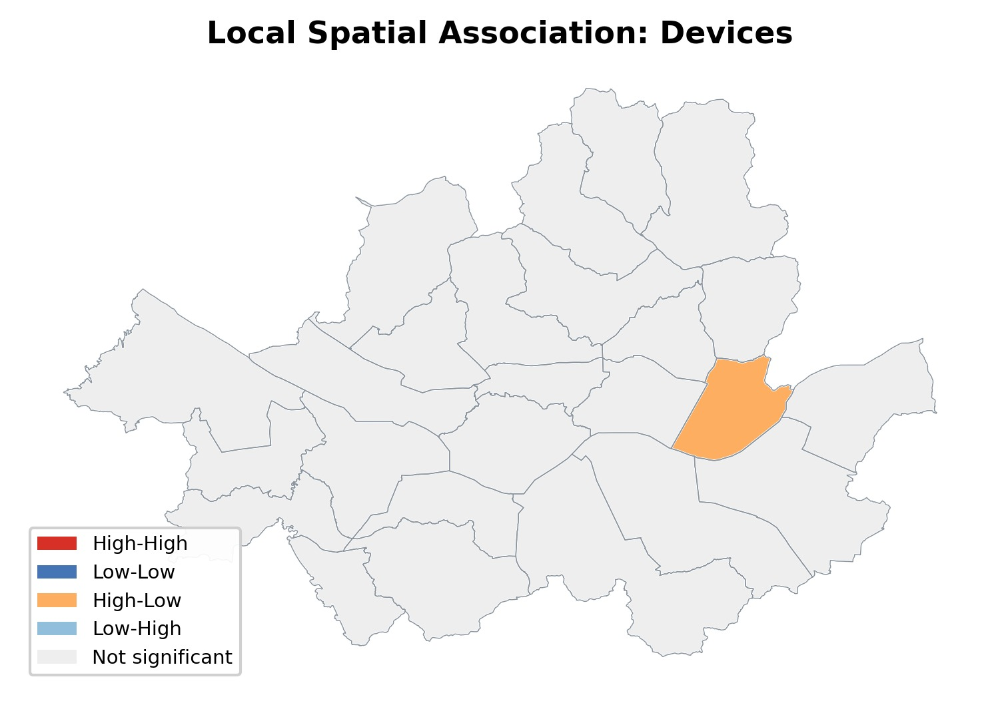{width="2.600997375328084in" height="1.8988265529308836in"}  |
+----------------------------------------------------------------------------------------+-----------------------------------------------------------------------------------------+
| Affordability                                                                          | Devices                                                                                 |
+----------------------------------------------------------------------------------------+-----------------------------------------------------------------------------------------+
| ## 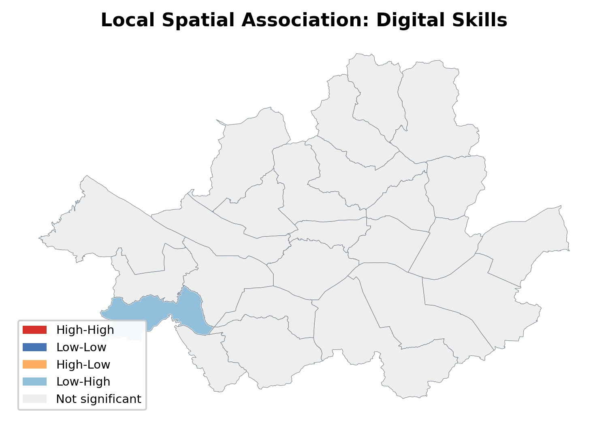{width="2.441666666666667in" height="1.7839785651793525in"} | ## 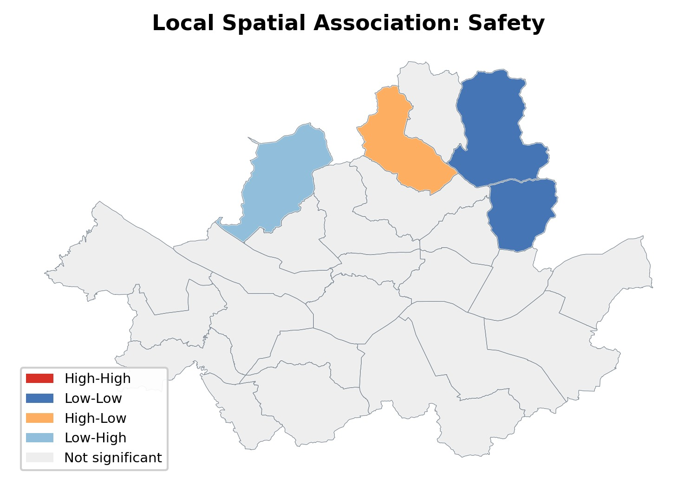{width="2.4260422134733157in" height="1.7701410761154857in"} |
+----------------------------------------------------------------------------------------+-----------------------------------------------------------------------------------------+
| Digital Skills                                                                         | Safety                                                                                  |
+----------------------------------------------------------------------------------------+-----------------------------------------------------------------------------------------+

: Figure 5. Spatial autocorrelation by UMC level across Seoul\'s 25
autonomous districts

## 3.2 Individual and District Characteristics and Digital Connectivity

The data used in this study have a hierarchical structure in which
individuals (Level 1) are clustered within autonomous districts (Level
2). Here, Level 2 corresponds to each individual\'s place of residence.
In this structure, conventional OLS regression can violate the
assumption of independent observations, underestimate the standard
errors of district-level predictors, and inflate Type I error
(Raudenbush & Bryk, 2002). Therefore, this study adopted a two-level
hierarchical linear model (HLM) that decomposes variance into
within-district and between-district components across Seoul\'s 25
autonomous districts and allows individual-level and district-level
variables to be entered simultaneously.

The Seoul Survey, used in the second analysis, is administrative data
that the Seoul Metropolitan Government has collected annually since 2003
from 20,000 households. Data collection is conducted every
August-September through a combination of non-face-to-face and in-person
interviews.

### 3.2.1 Variable Construction

First, the dependent variable in the analysis, the digital usage score,
is the summed score of eight items on digital service usage frequency
among the Seoul Survey response items. The eight items consist of living
information services, e-commerce services, financial transaction
services, public services, communication services, leisure services,
education and learning services, and mobile payment. These are not basic
acts of connection such as phone calls or text messaging, but rather
substantive additional uses mediated by digital devices, and were
therefore judged to be indicators suited to Seoul\'s advanced digital
environment. Each item was transformed from its original four-point
ordinal scale into a 0-10 continuous scale, yielding a continuous
variable ranging from 0 to 80 points. A higher score means that an
individual uses a more diverse range of digital services and can freely
use desired services.

The independent variables in this analysis are divided into
individual-characteristic variables and district-characteristic
variables (Table 2). The individual-characteristic variables consist of
sex, age, occupation, educational attainment, income level, and
disability status, all of which may affect individual digital usage.
Educational attainment was divided into four categories: middle school
completion or below, high school completion, college graduation
(reference category), and graduate school or above. Occupation was
divided into four categories: managers and professionals, clerical
workers (reference category), production and technical workers, and
other (students, homemakers, and unemployed persons). Housing type was
classified into four categories: apartment (reference category),
detached house, multiplex and multi-household housing, and other. Age
and income were grand-mean centered to improve the interpretability of
the intercept. In addition, a single-person household dummy, a
disability-status dummy, and a year dummy (reference: 2023) were
included.

As Level 2 variables, the analysis used three UMC dimension scores
constructed in Section 3.1 that represent exogenous factors determining
the local digital environment: Connectivity, Available for Use, and
Affordability. This choice reflects that Devices, Digital Skills, and
Safety are aggregated to the autonomous-district level from individual
responses in the Seoul Citizens\' Digital Competency Survey. To avoid
the resulting endogeneity problem, these three dimensions were excluded
from the main analysis, and dimensions judged more appropriate for
district-level universal meaningful connectivity were selected. District
average income and the aging rate were included as control variables,
and all Level-2 variables were standardized to the \[0, 1\] range using
Min-Max normalization, as in Section 3.1.

The analysis proceeds in four steps. After estimating an unconditional
model and calculating the intraclass correlation coefficient (ICC) to
confirm the justification for multilevel analysis, the study
sequentially estimates M1, which includes individual-level variables;
M2, which adds autonomous district-level variables; and M3, which
includes cross-level interactions. The cross-level interactions are
constructed as products of UMC infrastructure variables (Connectivity,
Available for Use, and Affordability) and vulnerable-group indicators,
in order to test whether the level of digital infrastructure in an
autonomous district operates differently for the digital usage of
vulnerable groups.

### 3.2.2 Analysis Results

The sample used in the analysis consists of a total of 10,000 Seoul
Survey respondents from 2023-2024, with an average of 400 sampled from
each of the 25 autonomous districts. \<Table 3\> presents descriptive
statistics for the main variables. The mean value of individual digital
connectivity was 60 out of 80 points, clearly demonstrating the high
level of digital connectivity among Seoul residents. Although the
dependent variable may exhibit negative skewness, the analysis was
conducted using the scale-linearized raw scores, given the institutional
standard scale and a sample size approaching 10,000.

Table 4. presents the sequential estimation results of the multilevel
models. The intraclass correlation coefficient (ICC) of the
unconditional model was 0.49%, indicating that the share of
between-district variance itself was not large. However, the design
effect, calculated in light of the average sample size of 400 persons
per autonomous district, was 2.94, exceeding the threshold of 2.0 and
confirming the validity of using a multilevel model (Hox et al., 2018).
Nevertheless, taken together, the small number of 25 autonomous
districts and the very small share of variance explained by autonomous
districts suggest that district-level connectivity-related
characteristics may have an extremely limited effect on individual
digital connectivity. These results may indicate that, because Seoul has
excellent digital connectivity and a high level of digital competency,
district-level connectivity infrastructure does not exert a measurable
effect. In addition, because the Seoul Survey records individuals\'
residential districts, those districts may not correspond to the areas
where individuals are directly affected by connectivity.

Among individual characteristics, the association with educational
attainment was the most pronounced. Education of middle school
completion or below was associated with a digital usage score
approximately 22.6 points lower than that of college graduates. This is
a substantial gap, corresponding to 28% of the 80-point scale. High
school graduates also scored 7.3 points lower than college graduates,
whereas those with graduate school education or above scored 2.9 points
higher, confirming a clear positive relationship between educational
attainment and digital usage capacity. Age also had a significant
effect. For each one-year increase from the mean age, the score for
individual digital connectivity decreased by 0.35 points, and among
older adults aged 65 or above, an additional 6.0-point decline was
observed apart from the age effect. A pronounced decline in digital
connectivity appeared among those aged 65 or above. In terms of
occupation, managers and professionals scored 2.3 points higher than
clerical workers, indicating that higher-income occupations tended to
have higher levels of digital usage. In terms of the residential
environment, residents of detached houses scored 2.5 points lower than
apartment residents, and residents of multiplex or multi-household
housing scored 1.8 points lower, which suggests that

  ---------------------------------------------------------------------------------------
  **Variable**             **Description**       **Level**    **Scale**      **Source**
  ------------------- ------------------------- ----------- -------------- --------------
  digital_use_score     Digital service usage       L1          0--80       Seoul Survey
                       score (sum of 8 items)                (continuous)     2023--24

  age_c               Age (grand-mean centered,     L1          years       Seoul Survey
                              M = 49.3)                                    

  female                 Female (ref: male)         L1           0/1        Seoul Survey

  Edu                    Education: ≤ middle        L1         0/1 each     Seoul Survey
                       school / high school /                              
                      graduate school or higher                            
                           (ref: college)                                  

  Income                   Monthly income           L1         10K KRW      Seoul Survey
                        (grand-mean centered)                              

  job                    Job: professional /        L1         0/1 each     Seoul Survey
                      blue-collar / other (ref:                            
                            white-collar)                                  

  disabled_bin            Disability status         L1           0/1        Seoul Survey

  hh_size_1            Single-person household      L1           0/1        Seoul Survey

  housing_detached /     Housing: detached /        L1         0/1 each     Seoul Survey
  \_multi / \_other     multi-family / other                               
                          (ref: apartment)                                 

  year                  Year 2024 dummy (ref:       L1           0/1        Seoul Survey
                                2023)                                      

  elderly                Older adults (≥65)         L1           0/1        Seoul Survey

  low_edu                 Lower educational         L1           0/1        Seoul Survey
                        attainment (≤ middle                               
                               school)                                     

  connectivity         Connectivity dimension       L2           0--1        UMC Part 1
                         score (normalized)                                

  wifi_total_n        Public Wi-Fi density per      L2           0--1       Local Admin
                            1K population                                     License
                            (normalized)                                   
  ---------------------------------------------------------------------------------------

  : Table 4. Variable Descriptions

This finding can be interpreted as reflecting not only income-level
differences by housing type but also differences in internet
connectivity conditions by building type. Single-person households also
scored 1.8 points lower than multi-person households. Among other
individual characteristics, women scored 2.6 points higher than men.
Women\'s higher digital connectivity relative to men may reflect their
greater responsiveness to various digital services in Korea. (Ref) These
results should be interpreted with attention to country-specific
sociocultural contexts. Respondents with disabilities scored 3.1 points
higher, which appears attributable to the characteristics of the sample.

At the autonomous district level, the UMC infrastructure dimensions were
generally not significant as main effects. In Model 2, none of the three
dimensions reached statistical significance, and the likelihood-ratio
test likewise indicated no significant improvement over Model 1.
However, in Model 3, which included cross-level interactions, the
Infrastructure dimension showed a significant negative effect. This
indicates the presence of differential effects across groups rather than
an average infrastructure effect.

The central finding of this analysis emerged in the cross-level
interactions. The interaction between public Wi-Fi density and the older
adult dummy showed a significant positive effect of 3.03 points. This
means that public Wi-Fi infrastructure provides relatively greater
benefits to older adults than to non-older adults. Residents with lower
educational attainment living in autonomous districts with higher levels
of digital infrastructure recorded markedly higher digital usage scores
than residents with lower educational attainment in areas with lower
infrastructure levels. This finding suggests that infrastructure
investment may have a disproportionately large effect in reducing the
digital divide among educationally vulnerable groups.

At the individual level, the interactions confirmed a pattern of double
vulnerability. Older adults living alone scored an additional 4.0 points
lower than older adults not living alone, and the negative effect of
lower educational attainment became larger with age. These findings show
that compound vulnerability factors intensify the digital divide more
than any single vulnerability factor.

  -------------------------------------------------------------------------------------
  **Variable**                  **N**    **Mean**   **Standard   **Minimum   **Maximum
                                                    deviation     (Min)**     (Max)**
                                                      (SD)**                
  ---------------------------- -------- ---------- ------------ ----------- -----------
  Digital usage score           10,000    60.88       16.84          0          80

  Age                           10,000    49.32       16.23         15          99

  Female, proportion            10,000     0.51         --           0           1

  Education: ≤ middle school    10,000     0.07         --           0           1

  Education: high school        10,000     0.25         --           0           1

  Education: graduate school    10,000     0.13         --           0           1
  or higher                                                                 

  Disability status             10,000     0.03         --           0           1

  Monthly income (10K KRW)      10,000    237.55      209.73         0         1,050

  Single-person household       10,000     0.17         --           0           1

  Older adults (age 65+)        10,000     0.22         --           0           1

  Cluster-level Connectivity      50       0.5         0.18        0.18        0.98
  Index (Connectivity, norm.)                                               

  Available for Use (norm.)       50       0.5         0.19        0.12        0.96

  Affordability (norm.)           50       0.5         0.22        0.07          1
  -------------------------------------------------------------------------------------

  : Table 5. Descriptive Statistics

> *Note. N = 10,000 individuals nested within j = 25 autonomous
> districts (2023--2024 pooled). Income is measured in 10,000 KRW units.
> District-level variables are min-max normalized indices (0--1 scale).*

**\**

+-------------------+-------------------+-------------------+-------------------+
| **Variable**      | **Model 1**       | **Model 2**       | **Model 3**       |
+===================+===================+===================+===================+
| *Level 1: Individual characteristics*                                         |
+-------------------+-------------------+-------------------+-------------------+
| Age (centered)    | −0.347\*\*\*      | −0.347\*\*\*      | −0.278\*\*\*      |
|                   | (0.012)           | (0.012)           | (0.014)           |
+-------------------+-------------------+-------------------+-------------------+
| Female            | 2.636\*\*\*       | 2.634\*\*\*       | 2.601\*\*\*       |
|                   | (0.305)           | (0.305)           | (0.305)           |
+-------------------+-------------------+-------------------+-------------------+
| Education: middle | −22.618\*\*\*     | −22.610\*\*\*     | −19.019\*\*\*     |
| school or below   | (0.770)           | (0.770)           | (2.379)           |
+-------------------+-------------------+-------------------+-------------------+
| Education: high   | −7.289\*\*\*      | −7.282\*\*\*      | −7.258\*\*\*      |
| school            | (0.380)           | (0.380)           | (0.380)           |
+-------------------+-------------------+-------------------+-------------------+
| Education:        | 2.906\*\*\*       | 2.909\*\*\*       | 2.912\*\*\*       |
| graduate school   | (0.483)           | (0.483)           | (0.481)           |
| or higher         |                   |                   |                   |
+-------------------+-------------------+-------------------+-------------------+
| Income (centered) | 0.003\*\* (0.001) | 0.003\*\* (0.001) | 0.002\*\* (0.001) |
+-------------------+-------------------+-------------------+-------------------+
| Job: professional | 2.329\*\*\*       | 2.326\*\*\*       | 2.28\*\*\*        |
|                   | (0.451)           | (0.451)           | (0.449)           |
+-------------------+-------------------+-------------------+-------------------+
| Job: blue-collar  | −0.373 (0.424)    | −0.379 (0.424)    | −0.385 (0.423)    |
+-------------------+-------------------+-------------------+-------------------+
| Job: other        | −1.233\*\*        | −1.226\*\*        | −1.105\* (0.454)  |
|                   | (0.456)           | (0.456)           |                   |
+-------------------+-------------------+-------------------+-------------------+
| Disability        | 3.084\*\*\*       | 3.081\*\*\*       | 3.006\*\*\*       |
|                   | (0.888)           | (0.888)           | (0.884)           |
+-------------------+-------------------+-------------------+-------------------+
| Single-person     | −1.775\*\*\*      | −1.776\*\*\*      | −0.877\* (0.367)  |
| household         | (0.338)           | (0.338)           |                   |
+-------------------+-------------------+-------------------+-------------------+
| Detached house    | −2.478\*\*\*      | −2.480\*\*\*      | −2.574\*\*\*      |
|                   | (0.377)           | (0.377)           | (0.379)           |
+-------------------+-------------------+-------------------+-------------------+
| Multi-family      | −1.798\*\*\*      | −1.795\*\*\*      | −1.933\*\*\*      |
| housing           | (0.408)           | (0.408)           | (0.408)           |
+-------------------+-------------------+-------------------+-------------------+
| Year (2024)       | 0.294 (0.283)     | 0.292 (0.283)     | 0.292 (0.283)     |
+-------------------+-------------------+-------------------+-------------------+
| Older adults (age | −6.046\*\*\*      |                   |                   |
| 65+)              | (1.696)           |                   |                   |
+-------------------+-------------------+-------------------+-------------------+
| *Level 2: Autonomous district characteristics*                                |
+-------------------+-------------------+-------------------+-------------------+
| Connectivity      | −1.127 (0.747)    | −1.688\* (0.804)  |                   |
+-------------------+-------------------+-------------------+-------------------+
| Available for Use | 0.085 (0.780)     | −0.200 (0.829)    |                   |
| (Wi-Fi)           |                   |                   |                   |
+-------------------+-------------------+-------------------+-------------------+
| Affordability     | −1.578 (1.135)    |                   |                   |
+-------------------+-------------------+-------------------+-------------------+
| Autonomous        | −2.035† (1.181)   |                   |                   |
| district income   |                   |                   |                   |
+-------------------+-------------------+-------------------+-------------------+
| Aging rate        | −0.298 (1.095)    | −0.293 (1.111)    |                   |
+-------------------+-------------------+-------------------+-------------------+
| *Interactions*    |                   |                   |                   |
+-------------------+-------------------+-------------------+-------------------+
| Older adults ×    | −3.958\*\*\*      |                   |                   |
| single-person     | (0.936)           |                   |                   |
| household         |                   |                   |                   |
+-------------------+-------------------+-------------------+-------------------+
| Age × lower       | −0.277\*\*\*      |                   |                   |
| educational       | (0.080)           |                   |                   |
| attainment        |                   |                   |                   |
+-------------------+-------------------+-------------------+-------------------+
| *Cross-level      |                   |                   |                   |
| interactions*     |                   |                   |                   |
+-------------------+-------------------+-------------------+-------------------+
| Connectivity ×    | −1.920 (1.901)    |                   |                   |
| older adults      |                   |                   |                   |
+-------------------+-------------------+-------------------+-------------------+
| Wi-Fi × older     | 3.026\* (1.515)   |                   |                   |
| adults            |                   |                   |                   |
+-------------------+-------------------+-------------------+-------------------+
| Autonomous        | 2.358 (1.532)     |                   |                   |
| district income × |                   |                   |                   |
| older adults      |                   |                   |                   |
+-------------------+-------------------+-------------------+-------------------+
| Connectivity ×    | 10.936\*\*\*      |                   |                   |
| lower educational | (3.370)           |                   |                   |
| attainment        |                   |                   |                   |
+-------------------+-------------------+-------------------+-------------------+

: Table 4. HLM Estimation Results

> *Note. Unstandardized coefficients with standard errors in
> parentheses. Model 0 = null model (intercept only). Reference
> categories: male, college education, white-collar job, apartment,
> multi-person household. †p \< .10, \*p \< .05, \*\*p \< .01, \*\*\*p
> \< .001*

### 3.3 Platform Text Analysis: LLM-Based Case Analysis of Digital Connectivity

Sections 3.1 and 3.2 quantitatively measured Seoul\'s digital divide
using administrative data and survey data and separated the roles of
individual characteristics and regional infrastructure. However,
quantitative indicators alone make it difficult to capture when, and in
what contexts, residents experience a lack of digital connectivity in
everyday life. Qualitative evidence must therefore be integrated to
narrow the distance between lived experience in the lifeworld and
structural indicators of digital connectivity.

The purpose of this section is to use unstructured text from a local
community platform to systematically extract latent cases of digital
deprivation across the six dimensions of UMC (Connectivity, Available
for Use, Affordability, Devices, Digital Skills, Safety) and to present
a methodological framework for combining these cases with the
quantitative analyses in Sections 3.1 and 3.2. Rather than treating the
platform itself as the object of analysis, the section seeks to recover
the connection between structure and experience through the
district-level lived-experience data provided by the platform.

### 3.3.1 Characteristics of the Danggeun Platform

The source of the unstructured text is neighborhood-life posts from
Danggeun, a Korean local community platform. Danggeun was selected for
three reasons. First, each post is automatically assigned geographic
metadata at the administrative-dong and autonomous-district levels,
allowing direct linkage with the UMC index constructed in Section 3.1.
Second, platform users are distributed broadly across all of Seoul\'s 25
autonomous districts, reducing concentration in a specific area or age
group. Third, because posts voluntarily record digital problems
encountered in everyday life, they can reveal lived deprivations that
researchers may not capture through surveys. The focus of this study is
not to evaluate the platform itself, but to use these structural
advantages to collect experiences from the lifeworld.

### 3.3.2 Why LLMs: Limitations of Existing Methods and the Structural Advantages of LLMs

Classifying unstructured text according to the six dimensions of UMC
requires meeting two requirements. First, it is necessary to determine
accurately whether a post is related to a digital connectivity problem
and, if it is, which dimension it corresponds to. Second, colloquial
Korean written in everyday language is difficult to process accurately
with simple morphological analyzers because of its agglutinative
features, including complex particles and inflectional endings. Existing
topic modeling or keyword-based classification is useful for identifying
latent themes, but it either does not align with predefined dimensions
or has limitations in analyzing conversational text. These limitations
are more pronounced because Korean morphological analyzers have low
accuracy on colloquial data, while machine-learning models that require
data training demand sufficiently large labeled datasets.

Large language models (LLMs) overcome a substantial share of these
constraints. Because they are pretrained multilingually, they can grasp
context without Korean morphological analysis, and models that handle
104 or more languages simultaneously share cross-linguistic semantic
representations that allow them to adapt to new tasks with only a small
number of examples. When LLMs are used as tools, their probabilistic
outputs and variability must be considered. Because results can differ
even for the same input, this study fixed the analytic procedure and
used the LLM only as a computational module for classification and
inference. This design makes it possible to apply researcher-defined
classification rules and inference protocols consistently while drawing
on the contextual understanding capacity of the LLM.

### 3.3.3 Analytic Structure

The text analysis consists of four stages. First, inaccessible posts
deleted from the crawled raw CSV data, along with advertising and
duplicate posts, are removed, and candidate UMC posts are extracted
using keyword dictionaries for the six dimensions. The keyword
dictionaries organize terms directly or indirectly related to digital
connectivity, and only posts containing those terms are extracted in the
first pass. Next, a first-stage classification (umc_related = Y/N/?)
determines whether each post is related to a digital connectivity
problem; to broaden the scope of judgment, the LLM is used without
detailed examples or restrictions. Then, only posts confirmed as related
are classified into cases corresponding to the six conceptual dimensions
by presenting the LLM with a few-shot prompt that includes detailed
examples provided by the user. In this stage, the model\'s autonomy is
constrained by providing only concrete classification criteria and
specifications, including examples in the prompt, and by strictly
managing the context, that is, the information space the model refers to
in making judgments.

Table 5. summarizes the analytic structure and sampling process. Of the
1,287,761 raw records, approximately 51.5% were excluded from the
analysis because their body text could not be viewed due to poster
withdrawal or blocking. After duplicate and advertising posts were
removed, approximately 480,000 posts remained, and applying the keyword
dictionaries for the six dimensions extracted 26,742 UMC-related
candidates. In the first-stage judgment using the few-shot prompt,
approximately 57.7% (15,438 posts) were classified as related (Y), 29.6%
(7,921 posts) as unrelated (N), and 12.6% (3,383 posts) as indeterminate
(?). Dimension classification was then conducted only on the posts
classified as Y.

In the dimension-classification judgment, the LLM was given prompts
containing three to four representative examples for each dimension.
Such few-shot prompts help the model learn human judgment criteria and
have been shown to perform better than zero-shot prompting on complex
tasks (ref). The examples also included negative examples showing which
types of posts were unrelated to digital connectivity issues, thereby
narrowing relevance as much as possible and securing high precision. In
the second-stage dimension classification, only specific classification
criteria and definitions were provided in the prompt, so that the model
could classify cases more autonomously. In this respect, the earlier
stage used an example-based few-shot approach, whereas the later stage
used rule-based prompts, showing a balance between reasoning and
few-shot prompting (see Figure 6).

  ------------------------------------------------------------------------
  **Stage**       **Description**                            **Remaining
                                                             Number of
                                                             Posts**
  --------------- ------------------------------------------ -------------
  Raw Data        All Neighborhood Life posts written        1,287,761
                  between May 2024 and March 2026            

  Accessible      Removed posts whose body text could not be 624,564
  Posts           checked because of account withdrawal or   
                  blocking                                   

  Duplicate and   Removed duplicate content and advertising  480,972
  Advertisement   or promotional posts                       
  Removal                                                    

  UMC Keyword     Extracted candidate posts by applying      26,742
  Filter          keyword dictionaries for the six           
                  dimensions                                 

  First-Stage     Classified UMC relevance using a few-shot  
  Judgment        prompt                                     
  ------------------------------------------------------------------------

  : Table 5. HLM Estimation Results

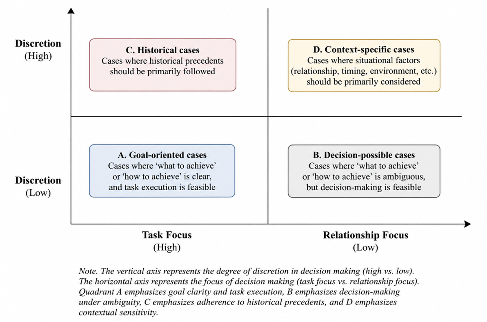{width="6.197916666666667in"
height="4.099825021872266in"}

Figure 6. Distinguishing the Roles of Classification and Reasoning

Subsequently, the classification results are aggregated at the
autonomous district level to create expression profiles, and Bayesian
updating is applied to combine them with the quantitative indicators in
Section 3.1. Bayesian updating was applied to combine quantitative
indicators with text classification results. The prior distribution is
the latent space of the six UMC concepts. For autonomous district j in
dimension d, let the observed UMC value be $s_{jd}$. The prior
distribution is $Beta\left( \alpha_{jd},\beta_{jd} \right)$ with
$mean\ s_{jd}$ so that the prior distribution is assumed to satisfy.
Using the concentration parameter κ, it is expressed as
$\alpha_{jd} = s_{jd} \cdot \kappa,\ \ \beta_{jd} = \left( 1 - s_{jd} \right) \cdot \kappa$.
In the text classification, when the number of posts assigned to the
corresponding dimension is $y_{jd}$ and the total number of classified
posts is $n_{jd}$, the likelihood is expressed as
$Binomial\left( n_{jd},\theta_{jd} \right)$. The posterior
$distribution\ is\ {\ \theta}_{jd}|y_{jd}\sim Beta(\alpha_{jd} + y_{jd},\beta_{jd} + n_{jd} - y_{jd}$
is calculated accordingly. The prior concentration κ uses a default
value of 20, with sensitivity analyses at 10 and 30. To prevent the
posterior distribution in autonomous districts with small numbers of
posts from being excessively dominated by the prior, the post count
$n_{jd}$ is adjusted by the living population and used as
$n_{jd}^{*} = n_{jd} \times \left( {livingpop}_{j}\text{/}mean\_ livingpop \right)$.

$$\alpha_{jd} = \kappa \times s_{jd}$$

$$\beta_{jd} = \kappa \times \left( 1 - s_{jd} \right)$$

$$\theta_{jd}|y_{jd} \sim Beta\left( \alpha_{jd} + y_{jd},\beta_{jd} + n_{jd} - y_{jd} \right)$$

$$n_{jd}^{*} = n_{jd} \times \left( livingpop{district}_{j}\text{/}mean\_ livingpop \right)$$

In the Bayesian aggregation, qualitative inference about causal
mechanisms was conducted for autonomous district-dimension combinations
in which the posterior distribution estimated from posts moved
meaningfully away from the prior distribution. Specifically,
interpretation was performed only when (1) the posterior shift was
statistically significant, (2) there were at least five posts classified
as Y in the relevant autonomous district and dimension, and (3) the
interpretation remained within the bounds permitted by the multilevel
model results in Section 3.2. For the combinations derived from the
prior distribution, three to five representative posts were selected,
and the linkage pathway between structural indicators and lived
experience was described in one or two sentences. Classification and
inference were conducted by three independent agents through different
reasoning paths, and the final judgment was made by a fourth agent who
compared and verified the three results. This followed a triangulation
approach that controls bias through cross-validation from multiple
perspectives rather than relying on a single protocol.

All classification and inference tasks were conducted by three
independent analytical agents using prompts and contexts based on
different reasoning approaches, and a fourth analyst compared and
verified the three results. This procedure is grounded in the
triangulation approach used in qualitative research to reduce bias by
drawing on multiple data sources and analysts. A post was included in
the final analysis only when the three perspectives converged, and
interpretive uncertainty was reflected in the presentation of the
results. The results of this process are summarized in \<Table 6\> and
\<Figure 7\>.

  ----------------------------------------------------------------------------------------
  **Category**       **Unit**              **What It Shows**  **Interpretive Cautions**
  ------------------ --------------------- ------------------ ----------------------------
  Observation Unit   Individual Post       Clues to           Regional structure cannot be
                                           experiences of     asserted on the basis of a
                                           digital            single post alone
                                           connectivity       

  Pattern Unit       Administrative-dong   Expression ratios  Aggregation criteria and
                     Posts                 and distributions  sample bias must be reviewed
                                           by dimension       together

  Structural Unit    UMC Regional          Regional-level     Interpret only in a limited
                     Indicators            connectivity       manner through consistency
                                           conditions         with the aggregated text
                                                              results

  Causal-Mechanism   Inference Mechanism   Explains the       Interpret only within the
  Unit                                     connection between bounds permitted by the
                                           cases and regional quantitative results in 3.2
                                           patterns           
  ----------------------------------------------------------------------------------------

  : Table 6. . Analysis Units and Interpretation Units in Section 3.3

### 3.3.4 Data and Scope of Application

The raw data consist of a crawl of all Neighborhood Life posts written
for Seoul\'s 25 autonomous districts from May 2024 to March 2026,
totaling 1,287,761 posts after duplicate removal. Of these, 766,891
posts (59.6%), comprising 663,163 deleted (DELETED) posts (51.5%) and
103,728 blocked (BLOCKED) posts (8.1%), were excluded from the analysis
because their body text could not be checked. The final analytic sample
consists of approximately 520,000 posts.

A review of the possibility of systematic bias from sample attrition
showed that the standard deviation of removal rates across autonomous
districts was 4.6%, indicating that variation across districts was not
large. Categories that were central to inferring digital deprivation,
such as Life/Convenience (47.0%), Neighborhood Incidents and Accidents
(48.4%), and Hospitals/Pharmacies (35.5%), had lower removal rates than
categories oriented toward socializing or promotion, such as
Neighborhood Friends (86.6%) and Education (69.0%). A substantial share
of deletions appears to have resulted from batch deletions associated
with user withdrawal. Nevertheless, it cannot be completely ruled out
that some deleted posts included cases related to digital deprivation,
or that the act of deletion itself was systematically associated with
digital deprivation. This constitutes a limitation of the present
analysis.

The structural limitations of the Danggeun data must also be recognized.
Because platform users themselves are limited to groups with digital
access, the experiences of digitally excluded groups are structurally
underrepresented. Since the temporal and spatial distribution of posts
is not uniform, sample bias may affect comparisons across autonomous
districts. These limitations are constraints of the data source, not
constraints of the methodology. In contexts where more direct
qualitative data are available, the same pipeline could be applied to
produce a more precise analysis.

{width="6.35in"
height="4.364057305336833in"}

### 3.3.5 Analysis Results

The text classification results are shown in Table 6. The Connectivity
(Connection Quality) dimension has the smallest range of shifts among
the six dimensions (-0.006 to +0.005). It can be viewed as a dimension
in which measured values and textual evidence generally converge.
Yangcheon-gu has a relatively low measured UMC value of 0.278, but its
share of related posts is comparatively high, producing a shift of
+0.005. By contrast, Yongsan-gu has a high measured value of 0.884, but
related posts are rare, producing a shift of -0.006.

In the Availability for Use dimension, Dobong-gu had the lowest measured
value (0.213) while also having a high share of related posts, producing
a shift of +0.006. Gwangjin-gu had a high measured value of 0.832 and
few related posts, recording a shift of -0.010.

The Affordability dimension showed a pattern consistent with income
levels across Seoul\'s autonomous districts. Jungnang-gu and Gangseo-gu
each showed positive shifts of +0.005, whereas Seocho-gu had the highest
measured value, at 0.993, and few related posts, producing a shift of
-0.007. This dimension is consistent with the tendency for concerns
about telecommunications fees and device purchase costs to be expressed
differentially by income level.

The Devices dimension shows the largest variation across autonomous
districts (gap = 0.090). Jungnang-gu had a measured value of 0.052, but
its share of device-related posts was 4.95%, the highest among all
autonomous districts, producing a shift of +0.048. Songpa-gu also showed
a similar pattern, with a shift of +0.026. By contrast, Yongsan-gu
(-0.042) and Dongjak-gu (-0.033) had high measured values but few
related posts. However, in this dimension, the measured indicator
captures device ownership, whereas the textual evidence captures
everyday transactions and difficulties related to devices, such as
secondhand transactions and repair requests. It is therefore difficult
to rule out the possibility that the two indicators partly refer to
different objects.

The Digital Skills dimension has the second-largest variation after the
Devices dimension (gap = 0.092). Jungnang-gu showed a shift of +0.047,
with a measured value of 0.242 and a related-post share of 4.8%.
Gangnam-gu also had a relatively low measured value of 0.276 and a
comparatively high share of related posts, producing a shift of +0.013.
By contrast, Gwanak-gu had the highest measured value, at 0.795, and few
related posts, producing a shift of -0.045.

The Digital Skills dimension showed the second-largest variation after
the Devices dimension. Jungnang-gu showed a shift of +0.047, with a
related-post share of 4.8% relative to a measured value of 0.242,
whereas Gangseo-gu showed a shift of -0.031 because related posts were
few despite a high measured value. In the Safety dimension, phishing and
voice-phishing cases constituted the main content of the posts, and
positive shifts were identified in Jungnang-gu (+0.018) and Dobong-gu
(+0.015). Jongno-gu had a very high measured value and few related
posts, so its posterior distribution shifted downward.

In the Safety and Security (Safety & Security) dimension, Jungnang-gu
(+0.018) and Dobong-gu (+0.015) had high shares of posts related to
phishing scams and voice phishing. Jongno-gu had the highest measured
value, at 0.984, but few related posts, producing a shift of -0.019. It
is necessary to also consider the possibility that the residential
composition of a tourism and commercial center differs from the
characteristics of Danggeun users.

When aggregated at the autonomous district level, differences between
regional measured values and post distributions can be classified into
three broad types. First are autonomous districts with positive mean
shifts. Jungnang-gu showed the largest positive shift in four of the six
dimensions and had the highest average value, at +0.020. Dobong-gu and
Gangnam-gu also showed positive mean shifts, although their magnitudes
were small, at approximately 0.001. In Gangnam-gu in particular,
positive shifts were observed in the Availability for Use and Digital
Skills dimensions despite the district\'s high average income,
suggesting that heterogeneous groups within the autonomous district may
be expressing related issues. Second are autonomous districts with
shifts close to zero. Gangbuk-gu (-0.000), Gangdong-gu (-0.001), and
Dongdaemun-gu (-0.001) fall into this category. In these districts,
positive and negative shifts are mixed across dimensions and tend to
cancel out on average. Third are autonomous districts with negative mean
shifts. Mapo-gu (-0.014), Yeongdeungpo-gu (-0.013), Gwanak-gu (-0.013),
and Seocho-gu (-0.009) fall into this category. In Gwanak-gu, the
population composition centered around university areas and the measured
value for Digital Skills may be associated with the rarity of
help-seeking posts. Seocho-gu showed particularly large negative shifts
in the Affordability and Devices dimensions. In sensitivity analyses
that varied the prior concentration κ across 10, 20, and 30, differences
in posterior means remained at the level of 0.00001 to 0.00010,
indicating no substantive change. This suggests that, after adjustment
by the living population, the effective number of observations was
sufficient and changes in the weight of the prior did not substantially
affect the results.

A point requiring caution in interpretation is that a positive shift
does not directly mean that the measured indicator has underestimated
the true condition. A positive shift may reflect lived inconveniences
that the measured indicator does not capture, but it may also include
cultural and demographic factors that make discussion of a particular
issue more active in a given autonomous district (ref). In addition,
sampling bias among platform users and temporal and spatial imbalances
in posts may affect interpretation of the results. Therefore, when
linking the direction and magnitude of posterior distributions to policy
implications, quantitative and qualitative indicators must be considered
together. What is meaningful in the results of this section is that the
sign and magnitude of shifts vary systematically by dimension and
autonomous district. If only the frequency of Danggeun Market posts is
aggregated, platform activity itself may be conflated with estimates of
UMC levels. The procedure of entering measured values as the prior
distribution and combining text classification results as the likelihood
partially separates the portion of observed text frequency attributable
to platform activity from the portion attributable to UMC levels. In
this sense, the prior-posterior shift functions as an indicator of the
extent to which textual evidence adjusts measured values.

However, two constraints must be considered when interpreting the
direction of a shift. First, even when a positive shift is observed, it
cannot be immediately concluded that the UMC level of the corresponding
autonomous district is lower than the measured value. A positive shift
suggests the possibility that residents perceive lived conditions not
captured by the measured indicator, but the way related topics are
expressed on the specific platform of Danggeun Market depends on the
composition of users by autonomous district. Second, a negative shift
should be read not as meaning that the autonomous district\'s UMC level
is higher than the measured value, but rather as a condition in which
there is relatively little incentive for related issues to be expressed
on the platform.

A cautious interpretation is warranted. As the contrast between
Jungnang-gu and Mapo-gu shows, the interpretation of the shift becomes
meaningful when combined with diverse contextual information, including
the autonomous district\'s demographic composition and platform-use
characteristics. Second, a negative shift should also be read not as
meaning that the autonomous district\'s UMC level is higher than the
measured value, but rather as indicating a condition in which there is
relatively little incentive for related issues to be expressed on the
platform. In this respect, it is also important to consider why local
resources may be lacking in practice yet remain undiscussed on the
platform.

  ---------------------------------------------------------------------------------------------
  Autonomous        Total Posts  Y Classification ? Classification N Classification Y Rate (%)
  District              (n)                                                         
  ----------------- ------------ ---------------- ---------------- ---------------- -----------
  Jungnang-gu          5,476           794               28             4,654          14.5

  Songpa-gu            9,367           860               99             8,408          9.18

  Seocho-gu            6,170           434              216             5,520          7.03

  Eunpyeong-gu         6,140           429               50             5,661          6.99

  Dobong-gu            3,491           233               5              3,253          6.67

  Seodaemun-gu         4,500           289               5              4,206          6.42

  Gangbuk-gu           3,885           247               31             3,607          6.36

  Yongsan-gu           3,012           181               12             2,819          6.01

  Yangcheon-gu         4,975           296               7              4,672          5.95

  Gangdong-gu          6,254           342              231             5,681          5.47

  Yeongdeungpo-gu      5,964           306               5              5,653          5.13

  Dongdaemun-gu        4,754           238               29             4,487          5.01

  Seongbuk-gu          5,437           266              141             5,030          4.89

  Jung-gu              1,351            63               16             1,272          4.66

  Gangseo-gu           8,174           371              236             7,567          4.54

  Geumcheon-gu         2,298           101               7              2,190           4.4

  Jongno-gu            2,267            97               27             2,143          4.28

  Dongjak-gu           3,675           150               22             3,503          4.08

  Gangnam-gu           10,047          404              459             9,184          4.02

  Seongdong-gu          404             16               9               379           3.96

  Gwanak-gu            11,665          407               75             11,183         3.49

  Mapo-gu              7,974           242              254             7,478          3.03

  Guro-gu              4,082           121               96             3,865          2.96

  Gwangjin-gu          5,440           147               42             5,251           2.7

  Nowon-gu             5,040           103               46             4,891          2.04
  ---------------------------------------------------------------------------------------------

  : Table 7. Post Classification Results

{width="6.35in"
height="2.9077569991251093in"}

Figure 9. Differences between prior and posterior distributions

  -----------------------------------------------------------------------
  **Type of        **Related UMC       **Number of       **Share (%)**
  deprivation**    dimension**         related posts     
                                       (n=100)**         
  ---------------- ------------------- ----------------- ----------------
  Information      **Digital Skills**  63                63.0
  absence                                                

  Lack of          **Available for     61                61.0
  institutional    Use**                                 
  pathways                                               

  Lack of device   **Devices**         50                50.0
  access                                                 

  Absence of       **Digital Skills**  45                45.0
  digital                                                
  competency                                             

  Lack of          **Connectivity**    40                40.0
  connectivity                                           
  infrastructure                                         

  Lack of public   **Available for     32                32.0
  access points    Use**                                 

  Lack of economic **Affordability**   27                27.0
  access                                                 

  Safety and       **Safety**          16                16.0
  security                                               
  deficiency                                             

  Composite        ---                 88                88.0
  deprivation (two                                       
  or more)                                               
  -----------------------------------------------------------------------

  : Table 8. Hypothesis-generation results: distribution by type of
  deprivation

> *Note. Because multiple types of deprivation may be inferred from a
> single post, the sum of the percentages exceeds 100%. Phase 1 is the
> hypothesis-generation stage, and the final classification is confirmed
> through triangulation in Phase 2 (judgment).*

## 3.4 Synthesis of Analytical Results

This section synthesizes the results of Section 3.1 (construction of the
UMC index), Section 3.2 (HLM multilevel analysis), and Section 3.3
(LLM-based text analysis) to provide an integrated interpretation of the
structure through which Seoul\'s digital divide operates. The three
analyses respectively answer the questions of \'where the divide
exists\' (measurement), \'why the divide arises\' (causal
identification), and \'how the divide is experienced\' (qualitative
context), and policy-relevant implications emerge at their points of
intersection.

The first finding jointly supported by all three analyses, and the
central empirical result of this project, is that Seoul\'s digital
divide is structured by differences between individuals rather than by
differences across autonomous districts. In the HLM analysis in Section
3.2, the ICC was only 0.49%, meaning that 99.5% of the variance in
digital usage scores was attributable to differences between individuals
within the same autonomous district. This result indicates that,
although the cross-district variation in the UMC composite index
constructed in Section 3.1 is real, its direct effect on individuals\'
level of digital usage is limited. However, this low ICC does not mean
that district-level variables are meaningless; rather, it suggests that
their effects are expressed differentially across groups. The
cross-level interaction results in Model 3 support this interpretation.

The text analysis in Section 3.3 specifies how this quantitative finding
is manifested in everyday life. The fact that \'information absence\'
appeared as the most frequent type of deprivation (63%) suggests that,
among those with lower levels of education, an information gap may
intensify in which the very existence of digital services is not
recognized. Cases in which users did not know about self-service
printing at convenience stores, did not know the ISP customer center
number, or did not know about Government24\'s public-document printing
function all point to a structural problem in which \'services exist but
are not visible to users.\' This can be interpreted as complementary
evidence that explains, at the experiential level, why the education
gradient is steep in the HLM.

The second finding is that the effects of autonomous-district
infrastructure are not significant at the level of main effects, but
operate significantly as moderating effects for specific vulnerable
groups. In Model 2, the main effect of the infrastructure variable
related to the Connectivity dimension among the UMC dimensions did not
reach statistical significance (p = 0.237), a result consistent with the
limited main effects of district-level variables when the ICC is 0.49%.
However, the significant cross-level interaction in Model 3 confirmed
that the effect of infrastructure operates not as an average effect, but
as a group-specific moderating effect.

The text analysis in Section 3.3 provides the qualitative context for
this differential effect. The fact that information absence regarding
public access points (print cafes, library multifunction printers, and
self-service printing) was inferred in 32% of posts shows that, even
when infrastructure physically exists, it is not converted into
substantive benefits unless users\' awareness and access capabilities
are also present. The case from Sinsa-dong, Eunpyeong-gu (\'Could it
really be that there is none?\') suggests the possibility that the user
had already attempted an online search but found the results
insufficient, thereby highlighting the gap between the existence of
infrastructure and its \'discoverability.\' When combined with the HLM
result that the infrastructure main effect was not significant, this
supports the interpretation that the effects of infrastructure
investment emerge only when accompanied by support for information
access and capabilities among vulnerable groups.

The third finding is that the digital divide is deepened by
intersections of complex vulnerability rather than by a single axis. In
the HLM, older adults living alone scored an additional 4.0 points lower
than older adults not living alone, and the negative effect of lower
educational attainment was found to accelerate as age increased. Section
3.3 likewise showed a consistent pattern of composite deprivation. On
average, more than 2.5 types of deprivation were identified per post,
and when information absence, competency absence, and blocked
institutional pathways overlapped, users were found to leave official
channels and rely on the community. The absence of a digital support
network (\'because they do not have children, or because they live apart
from them and find it difficult to ask\') shows that household
composition functions as an informal pathway for acquiring digital
competency, and can therefore be interpreted as a mechanism explaining
the additional gap among older adults living alone.

The fourth finding concerns the spatial clustering of Digital Deserts
and heterogeneity by dimension. In Section 3.1, among the bottom five
areas, northern Seoul in particular (Dobong-gu, Gangbuk-gu, Nowon-gu,
and Jungnang-gu) formed a Low-Low cluster in the UMC composite index;
while these areas recorded above the city average on the Connectivity
dimension, they showed extreme deficits in the Devices and Safety
dimensions. This heterogeneity in dimension-specific profiles suggests
the need for dimension-specific tailored interventions rather than
uniform infrastructure investment.

From a methodological perspective, combining the three analyses allows
their respective limitations to be mutually compensated. The composite
index in Section 3.1 identifies the relative positions of autonomous
districts but cannot capture within-individual variation, while the HLM
in Section 3.2 separates the contributions of individuals and areas but
cannot explain the qualitative pathways through which the digital divide
is manifested. The text analysis in Section 3.3 visualizes the
experiential context of deprivation but is limited in
representativeness. By combining the three analyses through sequential
triangulation rather than in parallel (measurement -\> causal
identification -\> qualitative context), the project was able to
construct an integrated answer to the three questions of \'where\'
(autonomous districts), \'why\' (the interaction between individual
characteristics and infrastructure), and \'how\' (the pathways through
which deprivation is manifested).

These synthesized results lead directly to the policy recommendations in
Chapter 4. The finding that individual characteristics are the dominant
explanatory variables provides the basis for prioritizing people-based
policies; the differential effects of infrastructure support the need
for place-based policies targeted to vulnerable groups; the confirmation
of complex vulnerability indicates the need for an integrated support
system rather than a single program; and the identification of spatial
clustering provides the basis for subregional governance.

# 4. Policy Recommendations

This chapter presents policy directions for addressing Seoul\'s digital
divide based on the analytical results in Chapter 3. The data used in
the analysis were collected in 2023-2024 and therefore reflect the
policy environment under the Framework Act on Intelligent
Informatization. As of January 2026, the Digital Inclusion Act came into
effect, shifting the policy frame from the previous approach centered on
closing the information gap to the expanded concept of digital
inclusion. The recommendations in this chapter present the gaps and
vulnerabilities identified under the previous system as empirical
evidence, while exploring their potential policy application within the
new legal framework.

## 4.1 Theoretical Framework for Policy Recommendations

Policy approaches to Seoul\'s digital divide can be divided into two
axes, people-based and place-based, and the analytical results in
Chapter 3 suggest that the former is appropriate as the central axis of
policy. In Section 3.2, Model 1, which included only individual-level
variables, explained 83.4% of the variance between autonomous districts;
this means that most of the cross-district gap in digital usage is
attributable less to intrinsic local characteristics than to differences
in the sociodemographic composition of residents in each district.
Accordingly, the primary route of policy intervention should be located
in a people-based approach that directly strengthens the digital
competency of groups with multiple vulnerability factors, such as older
adults with lower educational attainment and older adults living alone.

However, the place-based approach here must be distinguished from
uniform resource allocation at the autonomous-district level. The ICC of
0.49% indicates that variance between autonomous districts is not the
main source of the digital usage gap, suggesting that policies centered
on area-level allocation may be inefficient. What this project proposes
is a place-sensitive approach: a strategy that amplifies the effects of
people-based policies by improving spatial conditions. As confirmed in
the cross-level interactions, the fact that public Wi-Fi density had a
disproportionate effect for older adults (+3.03 points), and that the
level of connectivity had a disproportionate effect for those with lower
educational attainment (+10.94 points), means that raising the
infrastructure level in areas with high concentrations of vulnerable
groups can function as a key multiplier for people-based policies.

This dual approach is also consistent with internationally accepted
policy frameworks. OECD(2023) emphasizes that, under a structure of
widening interregional gaps (uneven divergence), place-based policies
and people-centered transfer policies are not mutually exclusive but
complementary, while ITU(2024)\'s UMC policy agenda likewise recommends
both target-group-centered policies and the development of national
digital strategies and roadmaps. EU Digital Decade 2030 establishes
national roadmaps for each member state across four axes - digital
skills, infrastructure, business, and public services - and operates a
cyclical structure in which progress is reviewed through annual
monitoring (European Commission, 2025). This structure of measurement
-\> monitoring -\> policy adjustment partly aligns with the analytical
procedure of this project.

## 4.2 People-based Policy Recommendations

**(1) Older adults living alone**

The predicted digital usage gap for older adults living alone is
approximately -10.87 points, corresponding to 13.6% of the full scale.
Whereas older adults in multi-person households can receive informal
digital support from household members, this pathway is absent for older
adults living alone. The text analysis in Section 3.3 confirmed how this
gap is manifested in everyday life. The case of an IT planner in
Munjeong-dong, Songpa-gu, who proposed app-use training for middle-aged
and older adults by stating, \'I suppose those reading this post are
already using them reasonably well; for those who do not have children,
or who live apart from them and find it difficult to ask,\' visualizes
the structure through which the absence of an in-household digital
support network leads to persistent difficulties with everyday digital
tasks.

Existing Digital Learning Centers have centered on group education and
have faced structural limitations in physically reaching older adults
living alone whose mobility is constrained. With the transition to AI
Digital Learning Centers from March 2026, outreach dispatch education is
expected to expand (Ministry of Science and ICT, 2025.12.24), but
program designs specialized for older adults living alone have not yet
been specified. The United Kingdom\'s Age UK Digital Champion Programme
has reported improvements in older adults\' digital confidence by
combining volunteer-based one-on-one home visits with device lending
(Age UK, 2023).

Taken together, policy for older adults living alone is insufficient if
it only expands access to group education; what is needed is a model
that substitutes for social scaffolding. Specifically, this report
recommends a one-on-one home-visit support system through the
cultivation of dong-level Digital Companions, the operation of cohorts
tailored to older adults living alone, and the parallel provision of
device lending.

**(2) Older adults with lower educational attainment**

In M3, the age x lower educational attainment interaction (-0.28, p \<
0.001) shows that the age-specific slope of decline in digital usage for
the lower-educational-attainment group is approximately twice as steep
as that for the college-graduate reference group. Over a 20-year age
range, this difference accumulates into an additional gap of
approximately 5.5 points, suggesting that the digital divide between
educational groups tends to widen as age increases.

The text analysis in Section 3.3 shows how this education gradient is
manifested in everyday life. The fact that \'information absence\'
appeared as the most frequent type of deprivation (63%) suggests that,
as educational level decreases, the gap in awareness of the very
existence of digital services intensifies. Cases in which users did not
know about self-service printing at convenience stores, did not know the
ISP customer-service telephone number, or did not know about
Government24\'s public-document printing function all point to a
condition in which \'services exist but are not visible to users.\' Such
information absence may be strongly associated with educational level,
because informational skill is proportional to level of education
(Hargittai, 2010).

It is unclear whether existing Digital Learning Centers systematically
provided differentiated pathways by educational level. Singapore IMDA\'s
Seniors Go Digital operates an integrated model that establishes a
three-stage pathway of basic, intermediate, and advanced levels, embeds
cybersecurity education at each stage, and combines device and fee
subsidies for low-income older adults (IMDA, 2020; CSA Singapore, 2023).
Security education is particularly relevant in the Seoul context, where
vulnerability in the Safety dimension was identified in Section 3.1.

The recommendations are to systematically differentiate staged pathways
by educational level, to adopt an integrated design that makes security
education mandatory at each stage, and to link device and fee support
for low-income older adults with lower educational attainment.

**(3) Strengthening the discoverability of digital services to address
information absence**

One policy task raised by the text analysis in Section 3.3 is that
existing digital competency education has focused on \'how to use\'
services, whereas the gap in \'awareness of existence\' has not been
sufficiently addressed as a policy issue. Information absence, inferred
in 63 of the 100 cases analyzed, refers not to a lack of capability to
use services but to a condition in which the existence of the services
themselves is unknown.

For example, in the case of a Bongcheon-dong resident in Gwanak-gu who
asked, \'It seems that court documents and the like cannot be printed at
ordinary print cafes; does anyone know where official documents can be
printed?\', neither the Government24 official-document printing function
nor the existence of court self-service issuance kiosks was visible to
the user. The expression \'Is there truly none?\' used in Sinsa-dong,
Eunpyeong-gu suggests that the user may already have attempted an online
search but found the results insufficient, highlighting the gap between
the existence of infrastructure and its \'discoverability.\'

This absence of information is difficult to resolve simply by
strengthening publicity. Passive provision of information reaches only
users who already possess the capacity to search for information.
Therefore, as a policy design principle, an approach is needed that
embeds the discoverability of digital services from the service design
stage onward. Specifically, we propose functions in public service apps
(such as Seoul ON) that provide location-based guidance to nearby public
digital access points (self-service printing, library multifunction
printers, and AI Digital Learning Centers), offline linkage that informs
residents of relevant digital services when they visit community service
centers for civil affairs, and the parallel listing of relevant digital
channels in text-message notifications from the competent dong office.

**(4) Structural Responses to the Educational Gradient**

Educational attainment is the strongest predictor of digital use, and
this gap has a structural character that is difficult to resolve through
short-term programs alone. It is therefore necessary to distinguish the
time horizons of policy. In the short term, the targeted programs
described above can contribute to mitigating current gaps; in the medium
to long term, systematically incorporating digital competency into
curricula from the basic education stage becomes a structural pathway
for preventing the cumulative widening of gaps in future generations.
The \'matters concerning activities to cultivate digital competency\'
and \'education, counseling, and publicity for digital inclusion\'
required in the basic plan under Article 8 of the Digital Inclusion Act
provide the institutional basis for encompassing precisely these short-,
medium-, and long-term policies at the same time.

## 4.3 Place-Based Policy Recommendations

**(1) Dimension-Specific Tailored Interventions for Digital Desert
Autonomous Districts**

Section 3.1 classified the five autonomous districts at the bottom of
the composite index (Jungnang-gu, Dobong-gu, Gangbuk-gu, Guro-gu, and
Nowon-gu) as \'Digital Deserts.\' Their core characteristic is that,
while they record levels at or above the city average in the
Connectivity dimension (Jungnang-gu 0.630, Gangbuk-gu 0.562), they
exhibit extreme deprivation in the Devices (Jungnang-gu 0.052) and
Safety (Dobong-gu 0.019) dimensions. This suggests that the main source
of disparity is not the absence of physical network infrastructure, but
rather a lack of the human and economic capabilities needed to use it.

Because the dimension-specific decomposition (Figure 5) confirmed that
each autonomous district has different vulnerable dimensions,
dimension-specific tailored interventions may be more effective than
uniform support. For example, device distribution and lending programs
should be prioritized in Jungnang-gu, where the Devices dimension is
extremely low, while security education and awareness-raising programs
should be prioritized in Dobong-gu, where the Safety dimension is
effectively close to zero. For autonomous districts vulnerable in the
Affordability dimension, fee subsidies and expansion of low-cost plans
constitute a more direct intervention pathway.

The text analysis in Section 3.3 provides concrete directions for
dimension-specific tailored interventions. In the case of Dobong-gu,
where the Safety dimension is extremely low, the text analysis showed
that cases of harm in online secondhand transactions were a major
manifestation of safety deprivation. The pattern in which the absence of
capacity to verify the condition of secondhand electronic devices is
combined with a lack of information about formal redress channels after
harm occurs (consumer counseling centers, police reports, etc.) suggests
that security education should extend beyond simple password management
to include consumer protection capacities in digital transaction
environments.

Given that the main effect of autonomous-district infrastructure
variables in M2 was not significant overall (p = 0.237), place-based
interventions have limits as a standalone means of closing the gap. This
means that more substantive effects can be expected when
dimension-specific tailored interventions are combined with the
people-based policies discussed in 4.1.1, for example, when device
distribution is accompanied by level-specific education.

It is necessary to examine whether the current policy system allocates
resources differentially in ways that reflect the characteristics of
each autonomous district. The United Kingdom\'s Digital Inclusion
Innovation Fund (£11.7M, 2025) adopted a model that allocates funding to
80 local projects through a community-led approach while differentiating
project content according to local needs (older adults, low-income
groups, migrants, etc.) (UK DSIT, 2025). This provides a reference case
demonstrating the feasibility of differentiated interventions suited to
local contexts.

**(2) Redesigning Public Digital Access Points**

The inference, in the text analysis in Section 3.3, that 32% of posts
reflected a lack of public access points raises the possibility that
Seoul\'s public digital infrastructure is not quantitatively
insufficient, but rather is designed and located in ways that do not
correspond to users\' task contexts. In cases such as a student living
alone in Sillim-dong, Gwanak-gu asking for a recommendation for \'a PC
room where document scanning is possible because mine is not working,\'
or a Bongcheon-dong resident in Gwanak-gu asking, \'Is there anywhere
near Sadang Station where I can use the internet and a printer?\', users
were not aware of existing public access points such as self-service
printing in convenience stores or library multifunction printers.

These findings suggest that policy on public digital access points
should shift from \'installation\' to \'discoverability and
accessibility.\' Specifically, we propose establishing an integrated
guidance system for public digital access points by autonomous district
(self-service printing, scanning, public Wi-Fi, and AI Digital Learning
Centers), strengthening searchability through data linkages with private
platforms such as Naver Map and KakaoMap, and securing access points
outside the operating hours of public facilities, including late-night
and weekend periods (for example, 24-hour self-service printing booths).

**(3) Coalition Governance for Seoul\'s Northern Region**

The spatial distribution of the UMC composite index (Figure 1) and the
LISA cluster analysis (Figure 5) show that Digital Desert autonomous
districts are clustered in northern Seoul in a statistically significant
manner. The physical adjacency of Dobong-gu, Gangbuk-gu, Nowon-gu, and
Jungnang-gu, which belong to the Low-Low cluster, suggests that this is
not a problem of individual autonomous districts but a structural
pattern at the regional scale.

This spatial clustering provides three grounds for recommending
cooperative governance at the regional scale. First, the LISA analysis
confirmed significant spatial autocorrelation, statistically supporting
the interpretation that this is a structural phenomenon rather than a
merely visual pattern. Second, if individual autonomous districts
independently build digital education programs or infrastructure,
resources become dispersed; however, if neighboring autonomous districts
jointly operate digital hubs or share education programs, economies of
scale can be achieved. Third, as confirmed in Section 3.1, adjacent
autonomous districts differ in their dimension-specific strengths and
weaknesses (e.g., Jungnang-gu\'s strength in Connectivity at 0.630
versus its weakness in Devices at 0.052), making cross-utilization of
resources possible.

Specifically, we propose establishing coalition governance for the
northern Digital Desert region (Dobong, Gangbuk, Nowon, Jungnang, and
others). This includes operating joint digital education hubs,
cross-utilizing dimension-specific strengths and weaknesses, and
securing budgets and planning projects at the regional scale. The
institutional pathway for this regional cooperation system is discussed
in 4.1.3 in connection with the basic-plan system of the Digital
Inclusion Act.

## 4.4 Integrated Policy Recommendations

The preceding analytical results and policy recommendations suggest that
the most substantive effects can be expected when people-based and
place-based approaches are combined. The combination of spatial
targeting and group targeting, that is, prioritizing people-based
policies such as outreach support for older adults living alone and
level-specific education programs in Digital Desert autonomous
districts, constitutes a concrete integrated pathway. The text analysis
in Section 3.3 demonstrates the specific form of this integration. The
finding that compound deprivation (88%) is widespread suggests that
single-axis policy interventions, such as providing devices only,
offering education only, or expanding infrastructure only, are
insufficient to address the overlapping structure of deprivation. For
example, even if devices are provided, the effects of device
distribution will be limited if users do not know that accessible
services exist (information absence) or if they lack the capacity to
operate the digital interfaces of those services (capacity absence).

Article 8 of the Digital Inclusion Act stipulates that the government
must establish a basic plan for digital inclusion every three years, and
that this basic plan must include \'improving accessibility and
supporting social participation for digitally vulnerable groups,\'
\'analyzing the status of digital inclusion and policy performance,\'
and \'activities to cultivate digital competency,\' among other matters.
Article 9 of the same Act requires relevant central administrative
agencies and local governments to establish and implement annual
implementation plans. The results of the multilevel analysis conducted
in this project, including the decomposition of between-district and
within-district variance, identification of vulnerable groups, and
dimension-specific profiling, can be used as empirical evidence in the
process of formulating this basic plan. In particular, the distribution
by deprivation type derived from the text analysis in Section 3.3
(information absence 63%, absence of institutional pathways 61%,
capacity absence 45%) provides empirical evidence that can inform
priority-setting in the basic plan.

The institutionalization of the coalition governance for the northern
Digital Desert region proposed in 4.1.2 can also be explored within this
system. Although the Digital Inclusion Act designates metropolitan and
basic local governments as the actors responsible for establishing and
implementing implementation plans, it does not contain separate
provisions for regional cooperation systems among adjacent basic local
governments. In the process of formulating the basic plan, it is
necessary to review institutional pathways for such regional
cooperation, for example, the creation of consultative bodies for joint
project planning among autonomous districts.

Finally, from the perspective of procedural generalizability discussed
in 1.1, the analytical framework of this project, namely digital divide
diagnosis (construction of a composite index and dimension-specific
decomposition) → multilevel analysis (separation of individual and
district contributions and identification of vulnerable groups) →
extraction of qualitative context (LLM-based classification of
deprivation types) → targeted policy design (integration of
people-based + place-based approaches), is significant as a
policy-derivation procedure that can be applied not only to
Seoul-specific prescriptions but also to other cities with similar data
structures.

# 5. Conclusion

## 5.1 Summary

This project applied the ITU\'s Universal Meaningful Connectivity (UMC)
framework to Seoul\'s 25 autonomous districts and constructed an
integrated analytical framework for measuring, analyzing, and
interpreting the digital divide within the city. By combining three
stages of analysis, construction of the UMC composite index (3.1), HLM
multilevel analysis (3.2), and LLM-based text analysis (3.3), as a
sequential triangulation, the project clarified at multiple levels where
Seoul\'s digital divide exists, why it emerges, and how it is
experienced.

First, the UMC composite index analysis found a gap of up to 2.5 times
in digital connectivity across Seoul\'s autonomous districts. The
difference between Seocho-gu (0.695) and Jungnang-gu (0.279) shows that,
contrary to the general perception of Seoul as a highly connected city,
a considerable relative gap is observed at lower-level administrative
units. In particular, Digital Deserts are spatially clustered in
northern Seoul (Dobong-gu, Gangbuk-gu, Nowon-gu, and Jungnang-gu), and
these districts exhibit dimension-specific heterogeneity: although they
are at or above the city average in the Connectivity dimension, they
show extreme deprivation in the Devices and Safety dimensions.

Second, the HLM analysis confirmed that Seoul\'s digital divide is
structured overwhelmingly by individual characteristics rather than by
regional infrastructure differences. The ICC was only 0.49%, indicating
that 99.5% of the variance was attributable to differences among
individuals, and educational attainment (middle school graduation or
less, −22.6 points) and age (−0.35 points per year) were the strongest
predictors. However, cross-level interactions showed significant effects
for public Wi-Fi density × older age (+3.03 points) and Connectivity ×
lower educational attainment (+10.94 points), confirming that regional
infrastructure provides disproportionately large benefits to vulnerable
groups. The additional gap for older adults living alone (−4.0 points)
and the accelerated pattern of age × lower educational attainment
support the existence of compound vulnerability.

Third, the LLM-based text analysis ran three independent inference
agents in parallel on 100 Danggeun neighborhood-life posts and generated
388 hypotheses of digital deprivation. Information absence (63%),
absence of institutional pathways (61%), and lack of device access (50%)
emerged as the main types of deprivation, and two or more forms of
deprivation overlapped in 88% of posts. This made visible, at the case
level, the manifestation pathways of deprivation that quantitative
analysis cannot capture: at what stage and for what reason official
channels are abandoned.

Based on these analytical results, Chapter 4 presented policy directions
that integrate people-based approaches (older adults living alone, older
adults with lower educational attainment, and responses to the
educational gradient) and place-based approaches (dimension-specific
tailored interventions for Digital Deserts and coalition governance for
the northern region). These directions are linked to the basic-plan
formulation system under the Digital Inclusion Act, which came into
effect in 2026, and the analytical framework itself has procedural
generalizability applicable to other cities with similar data
structures.

## 5.2 Limitations and Future Tasks

This project has the following limitations, which indicate directions
for future research.

First, there is the limitation of cross-sectional data. The Seoul Survey
(2023--2024) used in the HLM analysis and the administrative data used
to construct the UMC index capture cross-sections at specific points in
time and therefore cannot track temporal changes in the digital divide.
Panel data need to be constructed in order to determine how the effects
of individual characteristics such as educational attainment or age on
digital use change over time, and whether gaps actually narrow after
policy interventions. Although the fact that the Seoul Survey is an
annually conducted administrative survey suggests the possibility of
conversion to a panel structure, the current sample design is a repeated
cross-sectional structure and therefore has limits for individual-level
tracking.

Second, there are constraints on causal identification. HLM estimates
the direction and magnitude of relationships among variables, but
because the analysis is based on observational data, caution is required
for strict causal interpretation. For example, it is difficult to
separate whether the positive effect of public Wi-Fi × older age
observed in the cross-level interaction is a causal effect of public
Wi-Fi or an effect mediated by other characteristics of autonomous
districts with high public Wi-Fi density (welfare infrastructure,
population composition, etc.). Future research needs to identify causal
relationships more rigorously through quasi-experimental designs (such
as difference-in-differences) that use policy changes as exogenous
shocks.

Third, there are limits to the representativeness of the text analysis.
Posts on Danggeun's Neighborhood Life board are limited to platform
users, that is, groups that already have digital access; as a result,
the experiences of those most severely affected by digital exclusion are
structurally underrepresented. In addition, the current analysis is
based on the results of Phase 1 (hypothesis generation), which examined
100 posts, while Phase 2 (triangulation and final classification by
adjudication agents) has not yet been conducted. Once the future
full-corpus analysis (approximately 50,000 posts) and Phase 2
adjudication are completed, it should be possible to derive a more
systematic distribution of deficits by autonomous district and by
dimension.

Fourth, there are methodological constraints in constructing the UMC
index. This project applied equal weights to the six dimensions, but the
relative importance of dimensions may vary by context. For example, in
Seoul, where device ownership has become widespread, further review is
needed as to whether assigning the same weight to the Devices dimension
as in other cities is appropriate. In addition, because Min-Max
normalization is sensitive to extreme values, additional verification of
index stability is required given the small number of autonomous
districts (25).

Fifth, there is a limitation in the spatial resolution of autonomous
district-level analysis. Autonomous districts (n=25) are a relatively
coarse unit for capturing spatial variation in the digital divide within
Seoul. Even within the same autonomous district, differences may exist
across administrative dongs, and the administrative-dong metadata
assigned to posts in the text analysis in Section 3.3 suggests the
possibility of more fine-grained spatial analysis. If
administrative-dong-level data become available in the future, analysis
with higher spatial resolution will be possible.

Finally, the analytical framework of this project---constructing a
composite index based on the UMC framework, separating individual- and
district-level contributions through a multilevel model, and extracting
qualitative context using LLMs---has value not only as a basis for
Seoul-specific prescriptions, but also as a methodological framework
applicable to other cities with similar administrative data structures
and digital platform ecosystems. To test the external validity of this
framework, a future task is to apply it to regions with different levels
of urbanization and digital infrastructure environments.

# References

Allana, S., & Clark, A. (2018). Applying meta-theory to qualitative and
mixed-methods research: A discussion of critical realism and heart
failure disease management interventions. International Journal of
Qualitative Methods, 17(1), 1--11.
https://doi.org/10.1177/1609406918790042

Bhaskar, R. (1975). A realist theory of science. Leeds Books.

Dolowitz, D. P., & Marsh, D. (2000). Learning from abroad: The role of
policy transfer in contemporary policy-making. Governance, 13(1), 5--23.
https://doi.org/10.1111/0952-1895.00121

Greenhalgh, T., & Russell, J. (2009). Evidence-based policymaking: A
critique. Perspectives in Biology and Medicine, 52(2), 304--318.
https://doi.org/10.1353/pbm.0.0085

Head, B. W. (2010). Reconsidering evidence-based policy: Key issues and
challenges. Policy and Society, 29(2), 77--94.
https://doi.org/10.1016/j.polsoc.2010.03.001

Sayer, A. (1992). Method in social science: A realist approach (2nd
ed.). Routledge.

Age UK. (2023). Offline and overlooked: Examining the digital
experiences of older people. Age UK.

Borges, A. F. S., Oliveira, T., & Joia, L. A. (2020). Understanding
individual-level digital divide: Evidence of an African country.
Computers in Human Behavior, 106, 106247.
https://doi.org/10.1016/j.chb.2020.106247

Chipeva, P., Cruz-Jesus, F., Oliveira, T., & Irani, Z. (2018). Digital
divide at individual level: Evidence for Eastern and Western European
countries. Government Information Quarterly, 35(3), 460--479.
https://doi.org/10.1016/j.giq.2018.06.003

Crang, M., Crosbie, T., & Graham, S. (2006). Variable geometries of
connection: Urban digital divides and the uses of information
technology. Urban Studies, 43(13), 2551--2570.
https://doi.org/10.1080/00420980600970664

European Commission. (2025). State of the Digital Decade 2025 report.
European Commission.

González, C., Muñoz, R., & Bustos, B. (2025). Scientific evidence and
public policy: A systematic review of barriers and enablers for
evidence-informed decision-making. Frontiers in Communication, 10,
1632305. https://doi.org/10.3389/fcomm.2025.1632305

Hargittai, E. (2010). Digital na(t)ives? Variation in internet skills
and uses among members of the "net generation." Sociological Inquiry,
80(1), 92--113. https://doi.org/10.1111/j.1475-682X.2009.00317.x

Hilbert, M. (2011). Digital gender divide or technologically empowered
women in developing countries? A typical case of lies, damned lies, and
statistics. Women's Studies International Forum, 34(6), 479--489.
https://doi.org/10.1016/j.wsif.2011.07.001

Hill O'Connor, C. (2025). Lived experience perspectives in the Scottish
Parliamentary process. Centre for Public Policy, University of Glasgow.
https://www.gla.ac.uk/research/az/publicpolicy/

Hindman, D. B. (2000). The rural-urban digital divide. Journalism & Mass
Communication Quarterly, 77(3), 549--560.
https://doi.org/10.1177/107769900007700306

Hong, Y. A., Zhou, Z., Fang, Y., & Shi, L. (2017). The digital divide
and health disparities in China: Evidence from a national survey and
policy implications. Journal of Medical Internet Research, 19(9), e317.
https://doi.org/10.2196/jmir.7786

Hox, J. J., Moerbeek, M., & van de Schoot, R. (2018). Multilevel
analysis: Techniques and applications (3rd ed.). Routledge.

International Telecommunication Union. (2023). Measuring digital
development: Facts and figures 2023. ITU.

International Telecommunication Union. (2024). Measuring digital
development: Facts and figures 2024. ITU.

Mossberger, K., Tolbert, C. J., & Gilbert, M. (2006). Race, place, and
information technology. Urban Affairs Review, 41(5), 583--620.
https://doi.org/10.1177/1078087405283511

OECD. (2025). Place-based policies for the future. OECD Publishing.
https://doi.org/10.1787/e5ff6716-en

PLACE. (2025). 12 elements of place-based change. PLACE: Catalyst for
Community Change.
https://www.placeaustralia.org/resource/place-12-elements/

Raudenbush, S. W., & Bryk, A. S. (2002). Hierarchical linear models:
Applications and data analysis methods (2nd ed.). Sage.

Riley, B. (2025). The seven essentials of effective place-based growth:
What can the government learn from city-region mayors and devolved
nations? City-REDI, University of Birmingham.

UK Department for Science, Innovation and Technology. (2025). Digital
inclusion action plan: First steps. GOV.UK.

van Deursen, A. J. A. M., & Helsper, E. J. (2015). The third-level
digital divide: Who benefits most from being online? In L. Robinson, S.
R. Cotten, J. Schulz, T. M. Hale, & A. Williams (Eds.), Communication
and information technologies annual (Vol. 10, pp. 29--52). Emerald.

van Dijk, J. A. G. M. (2020). The digital divide. Polity Press.
